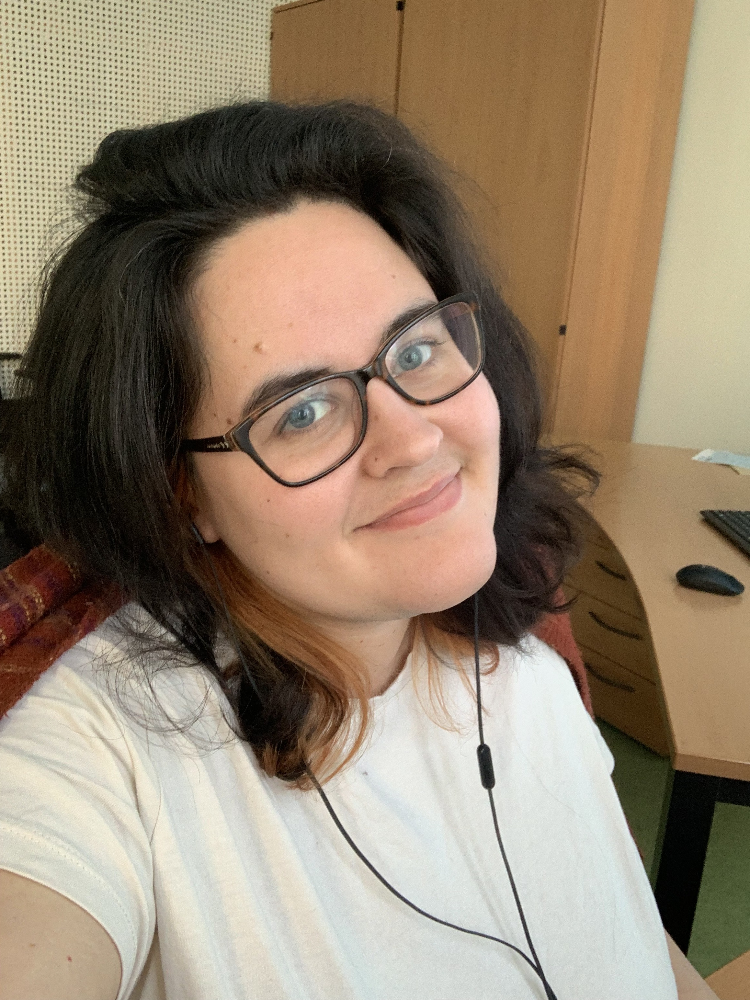

class: inverse, center, middle

```{r setup, include=FALSE}
options(htmltools.dir.version = FALSE)
library(leaflet)
#devtools::install_github("gadenbuie/countdown")
library(readr)
df <- read_tsv("./81A.tsv")
library(countdown)
#xaringan::inf_mr()
```

# Introduction to Fieldwork <br>
## From elicitation to ELAN &nbsp;

## Naomi Peck &nbsp;

### Albert-Ludwigs-Universität Freiburg <br> 2022-08-19 (updated: `r Sys.Date()`)
&nbsp;


---

class: middle, inverse

# You can find all of the slides from this workshop at: https://naomipeck.com/project/fieldwork-workshop

### To directly see sources/references, open the slideshow and press "p" to activate presenter view.

Alternatively, please let me know if you'd be interested in a certain topic and I can recommend some source to you!

???

Success!

---

class: middle

# I encourage you to use the chat during the workshop to talk with each other and ask any questions you may have!

---

# Hi!

.pull-left[
My name is Naomi Peck and I am a PhD student at the University of Freiburg, Germany.

I am writing my dissertation on the interaction of prosody, morphosyntactic structure, and information packaging in three languages of Arunachal Pradesh, India.

Pre-COVID, I was planning to write a descriptive grammar of Kera'a, one of the languages I use in my thesis.
]

.pull-right[

]

---

# Hi!

I have previously conducted two trips to the field (Dibang Valley and Lower Dibang Valley, India) and worked with a consultant of a different language at my previous university for approximately 3 years. I also just taught a Field Methods class on Ndebele, a Bantu language, with Kirsten Culhane. <br><br>

--

What you'll learn today *is not* everything there is to fieldwork. However, you should come away with ideas about how to get started with planning a fieldtrip, no matter whether this be in a different country or in the next village over. 

---

# Friday

- Fieldwork

- (Meta)data

- Recording and Elicitation

---

# Homework

- Collect some data of your own!

- Create metadata for the recording

---

# Saturday

- Introduction to ELAN

- Segmentation

- Transcription and Translation

- Interlinearisation

---

# Requirements

### Homework

- A recording device

    - Mobile phone
    - Computer with Audacity or Praat installed 
        - https://www.audacityteam.org/download/
        - https://www.fon.hum.uva.nl/praat/
    - Recorder with external microphone
- Someone you can record

--

### Saturday

- ELAN 6.2 or better (https://archive.mpi.nl/tla/elan/download)
- Earphones/headphones etc.

---

# Goal

By the end of this workshop, we will have:

- collected a recording

- processed the recording, including metadata

- started the analysis of the recording

You will also have the option to further:

- submit the recording and its annotation to an archive

--

###After this workshop, you should have an understanding of how to work with consultants to responsibly collect, process, analyse, and disseminate data.

???

Fieldwork is intense but it is an incredibly rewarding process to generate one's own data in search of new knowledge. I hope that you will also feel the same after the workshop too!

---

class: middle


# Let's learn something about you!

---

<div style='position: relative; padding-bottom: 56.25%; padding-top: 35px; height: 0; overflow: hidden;'><iframe sandbox='allow-scripts allow-same-origin allow-presentation' allowfullscreen='true' allowtransparency='true' frameborder='0' height='315' src='https://www.mentimeter.com/app/presentation/b3e7fe5357ebcee0a5fad6fc930a3330/e6d1b0d14f1e/embed' style='position: absolute; top: 0; left: 0; width: 100%; height: 100%;' width='420'></iframe></div>

---

class: inverse, center, middle

# The Field

---

class: middle

> #### *Fieldwork has been so much a part of linguistic research -- a linguistic given, so to speak -- that we have rarely bothered to define it.* 
>
> (Hyman 2001:15)

???

Hyman, Larry M. 2001. Fieldwork as a state of mind. In Linguistic Fieldwork, ed. by Paul Newman and Martha Ratliff, 15–33. Cambridge: Cambridge University Press.

---

class: center, middle

# What exactly is fieldwork?

---

class: middle

> #### *We define descriptive linguistic fieldwork as the investigation of the structure of a language through the collection of primary language data gathered through interaction with native-speaking consultants.*
>
>(Chelliah and de Reuse 2011:7) 

???

Chelliah, Shobhana L. and Willem J. De Reuse. 2011. *Handbook of Descriptive Linguistic Fieldwork*. Dordrecht: Springer.

---

# What about these?

.center[

]

???

Hyman, Larry M. 2001. Fieldwork as a state of mind. In Linguistic Fieldwork, ed. by Paul Newman and Martha Ratliff, 15–33. Cambridge: Cambridge University Press.

cited in

Chelliah, Shobhana L. and Willem J. De Reuse. 2011. *Handbook of Descriptive Linguistic Fieldwork*. Dordrecht: Springer.

---

class: middle, center, inverse

# Fieldwork is collaborating with others to actively generate (and analyse) data.

---

class: center, middle

# Where is "the field"?

---

class: top, left
background-image: url(./dscn0151_orig.jpg)

# 1

???

Photo: "Doing ethnobotanical fieldwork (Jilim village, 2018)"
https://dondaniels.weebly.com/pictures.html

---

class: top, left
background-image: url(./lamkang.jpg)
background-size: contain

# 2

???

Photo: "Donnu and Rengpu Rex eliciting and discussing Lamkang words"
https://digital.library.unt.edu/ark:/67531/metadc1470701/m1/1/

---

class: top, left
background-image: url(./socio-zoom.jpg)
background-size: contain

# 3

???

Photo: "Fieldworker’s screen: PowerPoint file with prompts (left), Zoom session with participant (top right), interface for audio files (bottom right)."
Figure 4 from Leemann et al. 2020. 

Leemann, Adrian, Jeszenszky, Péter, Steiner, Carina, Studerus, Melanie and Messerli, Jan. "Linguistic fieldwork in a pandemic: Supervised data collection combining smartphone recordings and videoconferencing" Linguistics Vanguard, vol. 6, no. s3, 2020, pp. 20200061. https://doi.org/10.1515/lingvan-2020-0061

---

class: top, left
background-image: url(./gibson-sisiwati.jpg)

# 4

???

Photo: "Data collection for siSwati with Sikhumbuzo Khoza, Judith Nkuna & Kyoung-Won Jeong (Bongane Nyambi out of shot)"
https://fieldnotespod.com/2020/04/30/ep-15-rethinking-the-field-in-fieldwork-with-hannah-gibson/

---

class: top, left, inverse
background-image: url(./akumbu-babanki.jpeg)

# 5

???
Photo: "Pius Akumbu (left) with some Babanki speakers (Victor Veshi, Prudencia Ngoin, Duh Joseph, and Maley) after a child celebration ceremony"
https://fieldnotespod.com/2020/07/10/ep-24-pius-akumbu-on-insider-research-in-babanki/

---

class: top, left, inverse
background-image: url(./cruz-chatino.jpg)

# 6

???

Photo: Hilaria collecting recordings (photo by Erika Castillo Licea)
https://fieldnotespod.com/2021/05/06/episode-27-field-notes-live-show-with-hilaria-cruz-on-field-linguistics-chatino/

---

class: middle, center

# Let's see what you all think.

---

<div style='position: relative; padding-bottom: 56.25%; padding-top: 35px; height: 0; overflow: hidden;'><iframe sandbox='allow-scripts allow-same-origin allow-presentation' allowfullscreen='true' allowtransparency='true' frameborder='0' height='315' src='https://www.mentimeter.com/app/presentation/4b6e6cfe9f4e31f7150a8da0bf6045b6/8579c98edf1c/embed' style='position: absolute; top: 0; left: 0; width: 100%; height: 100%;' width='420'></iframe></div>

---

class: center, middle, inverse

# The field is where the consultants are.

---

class: center, middle

# Who does fieldwork?

---

# Who fieldwork?

Minimally two people:

- researcher
    
- consultant/collaborator/speaker/signer/colleague

???

Never call the person you work with an informant!

--

However, it tends to involve many, many more!

???

Who else participates in the process of fieldwork?

--

- lots more people who are happy to help out (or get paid) for data collection

- separate person doing the recordings

- separate interviewer

- translators

- transcribers

- funding bodies and other authorities

- the wider speech community

???

Researchers can be outsiders or insiders to a community.

---

class: middle, center

# How is fieldwork done?

---

class: middle

> #### *Typical day, we would get up in the morning, you know and head off. Two or three interviews. Come back. Eat together. And then go to our room and transcribe. So it was pretty- we didn't have a lot of down time and then on the weekends, we would catch up on our phonetic transcription.* 
>
> -- Walt Wolfram 
>(Tagliamonte 2016:98)

???

Tagliamonte, Sali A. 2016. *Making Waves: The Story of Variationist Sociolinguistics*. Oxford: Wiley Blackwell.

---

class: center, middle

# Why do fieldwork?

---

# Why fieldwork?

Himmelmann 2006 argues for three main reasons for language documentation:

1. capture endangered languages

1. building up research resources for the future

1. ensure robust linguistic analyses

???

Himmelmann, Nikolaus P. 2006. Language documentation: What is it and what is it good for? In Essentials of Language Documentation, ed. by Jost Gippert, Nikolaus P. Himmelmann, and Ulrike Mosel, 1–30. (Trends in Linguistics. Studies and Monographs 178.) Berlin and New York: Mouton de Gruyter.

--

To this, we can add some other reasons why people do fieldwork:

1. religious reasons

1. language revival

1. theoretical research

1. comparative research

1. variationist research

???

Chelliah, Shobhana L. and Willem J. De Reuse. 2011. *Handbook of Descriptive Linguistic Fieldwork*. Dordrecht: Springer.

---

class: middle

# Why do you want to do fieldwork?

---

<div style='position: relative; padding-bottom: 56.25%; padding-top: 35px; height: 0; overflow: hidden;'><iframe sandbox='allow-scripts allow-same-origin allow-presentation' allowfullscreen='true' allowtransparency='true' frameborder='0' height='315' src='https://www.mentimeter.com/app/presentation/0b9d2d2f4165ae4a9e5f7e5ee2745d64/df3194d20a7b/embed' style='position: absolute; top: 0; left: 0; width: 100%; height: 100%;' width='420'></iframe></div>

---

class: center, middle

# When can I go to the field?

---

# When fieldwork?

This really depends on a number of factors, such as the field site, researcher availability, funding issues and much much more.

In short: any time!

---

class: middle

# But first:

### Let's brainstorm what we might have to keep in mind when going to the field.

---

# Going to the field

There are a number of people involved in the fieldwork process, each with different stakes in the research process.

Over the next five minutes, each of you will take on a role of one group involved in fieldwork and brainstorm potential issues that might be important for your 'stakeholder' group.

1. Researcher going to the field
1. Community members
1. Archivist/librarian
1. Funding body (university, grant giver etc.)

Afterwards, we will collate the ideas on a digital whiteboard and have a general discussion about what this means for how to do fieldwork.

---

# Issues in Fieldwork

```{r stakeholder-task, echo = FALSE}
countdown(minutes = 5, play_sound = TRUE, right = "34%", bottom = "34%")
```

---

background-image: url(./stakeholder-whiteboard.png)
background-size: cover

---

class: inverse, center, middle

# Short Break

```{r break1, echo = FALSE}
countdown(minutes = 10, play_sound = TRUE, right = "34%", bottom = "20%")
```

---

class: inverse, center, middle

# (Meta)data

---

class: middle

# What should we take into account when we collect data?

???

Write in the chat ideas about what things need to be collected!

---

# Primary Data

Primary data is directly generated in the process of fieldwork. <br><br>

--

There are three main types of primary data: <br><br>

--

1. Introspective <br><br>

???

e.g. grammaticality judgment

--

2. Elicited <br><br>

???

e.g. direct translations; recordings

--

3. Observed

???

e.g. natural conversation; e.g. field notes

---

# Primary Data

These data differ according to different parameters: <br><br>

--

1. naturalistic vs. controlled <br><br>

--

2. spontaneous vs. elicited <br><br>

--

3. audiovisual vs. written

---

# Secondary Data

Secondary data involves a level of abstraction away from primary data sources. <br><br>

--

1. Annotations (of multiple levels and formats) <br><br>

--

2. Structural analyses (syntagmatic/paradigmatic)<br><br>

--

3. Lexical data (including dictionaries)

---

# Tertiary Data

Tertiary data involves another level of abstraction from secondary data.

---

# Tertiary Data

```{r, label="wals-map", out.width='100%', fig.height=6, echo=FALSE}

#str(df)
wals <- df[,c(2:6)]
#str(wals)
wals$value <- as.factor(wals$value)
wals$description <- as.factor(wals$description)

pal <- colorFactor("viridis", domain = c(1:7))

leaflet(data = wals) %>% addTiles() %>% 
  addCircleMarkers(~longitude, ~latitude,
    popup=~name, 
    label=~description, 
    color=~pal(value),
    stroke = FALSE,
    fillOpacity = 1
  )
```

???

Data from:
Matthew S. Dryer. 2013. Order of Subject, Object and Verb. In: Dryer, Matthew S. & Haspelmath, Martin (eds.) The World Atlas of Language Structures Online. Leipzig: Max Planck Institute for Evolutionary Anthropology. (Available online at http://wals.info/chapter/81, Accessed on 2022-01-14.)

---

# Metadata

Metadata is data about the data you are collecting which will not necessarily become an object of your research.

--

.pull-left[
- age of participant
- gender of participant
- location of recording
- role of participant 
- identifiers of texts 
- languages used
- format of a file
]

.pull-right[
- description of a file
- date of creation of a file
- relations between files (i.e. video and audio belonging to the same recording session)
- size of a file in bytes
- equipment used to create a file (e.g. recording device)
]

---

# (Meta)data should be **FAIR**.

--

##**F**: Findable

##**A**: Accessible

##**I**: Interoperable

##**R**: Reusable

???

How could you apply these concepts to your own data?

---

# FAIR Guiding Principles (Wilkinson et al. 2016)

.center[

]

???

Wilkinson, Mark D., Michel Dumontier, IJsbrand Jan Aalbersberg, Gabrielle Appleton, Myles Axton, Arie Baak, Niklas Blomberg, et al. 2016. The FAIR Guiding Principles for scientific data management and stewardship. *Scientific Data* 3(1). 160018. https://doi.org/10/bdd4.

What do you think FAIR data and metadata means for you and your research?

---

# Archiving

Archiving allows us to keep our (meta)data **FAIR**.

--

There are a number of archives which accept linguistic data around the world.

.pull-left[
### Language Documentation Archives
- ELAR
- PARADISEC
- AILLA
- CORSAL
- Language Archive Cologne
- Pangloss Collection
- ...
]

.pull-right[
### Other Archives
- Zenodo
- Institutional Data Repositories
- ...
]

---

# Inspecting a collection

By yourself, go to an archive and choose a collection. For this collection, take notes on the following:

1. What genres of recordings/files are included?
1. What kinds of file types are included?
1. What type of access is allowed to the files?
1. What kind of metadata is provided at the item level?
1. What kind of metadata is provided at the collection level?

--

Here are some recommendations of collections to inspect:

- [Panare (ELAR)](https://www.elararchive.org/uncategorized/SO_57c13fe6-815c-4300-8916-816cb1310400/)
- [N|uu (ELAR)](https://www.elararchive.org/uncategorized/SO_9cec9120-9b22-42b0-9315-534f06b43313/)
- [Hrusso Aka (ELAR)](https://www.elararchive.org/uncategorized/SO_fd174d12-6d28-43c3-8da7-84a1533a982e/)
- [Syuba (PARADISEC)](https://catalog.paradisec.org.au/collections/SUY1)
- [Edwards Thesis Recordings (PARADISEC)](https://catalog.paradisec.org.au/collections/OE1)

---

```{r archive-task, echo = FALSE}
countdown(minutes = 15, play_sound = TRUE, right = "34%", bottom = "34%")
```

---

background-image: url(./file-whiteboard.png)
background-size: contain

# Genres

---

background-image: url(./filetypes-whiteboard.png)
background-size: contain

# File Types

---

background-image: url(./access-whiteboard.png)
background-size: contain

# Access

---

background-image: url(./item-whiteboard.png)
background-size: contain

# Item Metadata

---

background-image: url(./collection-whiteboard.png)
background-size: contain

# Collection Metadata

---

class: inverse, center, middle

# Short Break

```{r break2, echo = FALSE}
countdown(minutes = 10, play_sound = TRUE, right = "34%", bottom = "20%")
```

---

class: inverse, center, middle

# Recording and Elicitation

---

class: middle

> #### *Put simply, audio is presently seen as an <mark>inconvenience</mark> on the way to transcription, annotation, selection or analysis.* 
>
> (Nathan 2010:267)

???

Nathan, David. 2010. Sound and unsound practices in documentary linguistics: towards an epistemology for audio. In Peter K. Austin (ed.) *Language Documentation and Description, vol 7*, 262-284. London: SOAS.

---

# Recording

A big part of 'digital methods' in fieldwork is the ability to record your data and use it at a later time!

--

This means we need to understand a few different issues to make our lives easier:
- Informed Consent

- Signal-to-Noise Ratio

- Tips for better recordings

- File naming

- File formats

---

# Informed Consent

In the EU, we are required to abide by the GDPR. This means we must be careful when dealing with personal data, which inevitably impacts how we go about data collection. Even anonymising counts as processing personal data. Unfortunately for us, recording audiovisual data is something we rarely anonymise.

???

As such, it is incredibly important to collect the explicit consent of those who you work with when applicable.

--

1. Informed consent can be oral or written, depending on what is most appropriate. 
1. All forms of taking informed consent should be done in clear and simple language.
1. Make sure to say how personal data will be processed and how long it will be stored for, as well as which purposes the personal data will and will not be used for.
1. Consent is not explicitly required under the GDPR for archiving or scientific research. However, it is ethically wrong to archive recordings of people without their consent.

---

# Signal-to-Noise Ratio

<!-- add image here -->
.center[

]

--

.center[

]


---

background-image: url(./snr_example.jpg)
background-size: 80%

---

# Tips for better recordings

1. Have as little background noise as possible: turn off electrical equipment, use a windscreen/dead kitten, record when it is not so noisy, dampen potential echoes using blankets, and avoid creating extra noises when recording by e.g. typing or clicking a pen.

1. Monitor the recording through a pair of headphones throughout the recording or have a separate person fulfil this role.

1. Make sure your microphone is steady and will not move around. Consider using a tripod or mount if needed.

1. Adjust your microphone placement properly so that any unidirectional microphones are pointed (roughly) at the bottom lip of a speaker. This should avoid capturing pops created by plosives.

1. Aim to keep audio recording gain at around -12dB with a maximum -3~-6dB. Clipping occurs at 0dB.

---

# File Naming

How we name our files should be **FAIR**.

Things to keep in mind:
- filenames must be unique
- sessions should share the same filename
- filenaming for one data collection purpose may not be relevant for another purpose

<br><br><br>

.center[
## ISO Code - Your Initials - Date - KeyWords . FileType
]

---

# File Formats

.pull-left[
## Gold Standard
### Open File Formats
supported by many developers; can be used by multiple applications
**Examples**: .pdf, .txt, .csv, .png, .xml
### Lossless File Formats
does not lose information when compressed or made smaller
**Examples**: .wav, .pdf, .png
]

.pull-right[
## Avoid Where Possible
### Proprietary File Formats
supported by one developer; dependent on one application
**Examples**: .rar, .flextext, .avi
### Lossy File Formats
loses information when compressed or made smaller<br>
**Examples**: .mp3, .jpg, .mp4
]

---

class: middle

> #### *Remember, friends don't let friends save phonetic data in lossy formats (e.g., .mp3, AAC, .wmv)!* 
>
>(Styler 2017:57)

???

Styler, Will. 2021. *Using Praat for Linguistic Research*, version 1.8.3. Last updated March 10, 2021. http://wstyler.ucsd.edu/praat/

---

class: inverse, center, middle

# Elicitation

---

class: middle

>####*... elicitation is the general term for describing various methods of directed data collection and thus for corpus construction.*
>
> (Senft 1995:105)

???

Senft, Gunter. 1995. Elicitation. In Jef Verschueren, Jan-Ola Ostman, and Jan Blommaert (eds.), *Handbook of Pragmatics: Manual*, 577–581. Amsterdam and Philadelphia: John Benjamins.

---

class: middle

> #### *To obtain the data most important for linguistic theory, we have to observe how people speak when they are not being observed.* 
>
> (Labov 1972:113)

???

Labov, William. 1972. Some principles of linguistic methodology. *Language in Society* 1, 97-120.

To get around the observer's paradox, aim to ask questions which prompt unreserved reactions or engage your consultants in the data collection process, so they become collaborators rather than 'lab rats'.

---

# Elicitation Techniques

.pull-left[
- Word Lists
- Translations of sentences
- Translations of texts
- Elicitation of linguistic structure
- Elicitation of linguistic paradigms
- Grammatical judgements
- Field experiments
]

.pull-right[
- Text elicitation
    - Stimuli texts
    - Personal narratives
    - Historical narratives
    - folktales
    - descriptions/instructions
- Sociolinguistic interview 
]

---

class: center, middle

> ####*Think hard first, record later.*
>
> -- Peter Ladefoged
> (Sakel and Everett 2012:113)

???

Sakel, Jeanette, and Daniel L. Everett. 2012. *Linguistic fieldwork: A student guide*. Cambridge: Cambridge University Press.

---

# Best Practices

- Test your sound levels before starting and adjust them as needed.

- Always doublecheck you are recording before you start.

- Make a sharp, loud noise (e.g. a clap) in front of the microphone to indicate the start of a recording. This is incredibly helpful for syncing multiple audiovisual streams.

- Briefly list relevant metadata at the start of the recording (e.g., purpose of recording, who is recording, who will be speaking/signing, date of recording, location).

- Continue monitoring your sound quality throughout the recording.

- Prompt your speaker/signer, but do not interrupt them. You want to collect their data, not yours!

- Briefly summarise your session or get your speaker to do so before ending your recording.

- Fill out your metadata and backup and rename your files as soon as possible after sessions.

---

# Elicitation Task 1: Jackal and the Crow

<br><br><br><br>

.center[
# Volunteer?
]

???

1. Individual card descriptions
*‘I have some pictures here that tell a story. I’m going to show you the pictures, one at a time, and I want you to tell me the story.'*

2. Retelling, if necessary
*‘Now we've seen all the pictures I would like you to tell me the whole story together.’*

---


background-image: url("jackal-1.png")
background-size: contain
class: top, left

#1

---

background-image: url("jackal-2.png")
background-size: contain
class: top, left

#2

---

background-image: url("jackal-3.png")
background-size: contain
class: top, left

#3

---

background-image: url("jackal-4.png")
background-size: contain
class: top, left

#4

---

background-image: url("jackal-5.png")
background-size: contain
class: top, left

#5

---

background-image: url("jackal-6.png")
background-size: contain
class: top, left

#6

---

background-image: url("jackal-7.png")
background-size: contain
class: top, left

#7

---

background-image: url("jackal-8.png")
background-size: contain
class: top, left

#8

---

background-image: url("jackal-9.png")
background-size: contain
class: top, left

#9

---


---

# Elicitation Task 2: Word List

<br><br><br><br>

.center[
# Volunteer?
]

???

*"I am now going to ask you about how to say some words in your language."*

words about body parts/face

---

---

# Homework

For tomorrow's session, you will need an audio(visual) recording 3-5 minutes in length. This recording should be in a language which you are comfortable transcribing and analysing, such as German or English.

--

<br>

You must...

1. plan your session
1. test out your recording set-up
1. ensure informed consent is collected, either in writing or orally
1. record using an elicitation technique explored today
1. get the recording onto your computer
1. rename the file
1. create some metadata

--

A handout is available on my website with further details.

---

# Homework

If you wish to archive your recording and annotations, please use the informed consent form from my website. This will ensure that whoever you record understands what is entailed in the archiving of their data.

The deadlines for inclusion in the archive are the following:

1. Telling me that you wish to archive: <mark>21 August 2022</mark>

1. Submission of primary data and metadata: <mark>31 August 2022</mark>

1. Submission of secondary data: <mark>30 September 2022</mark>

Please send me an email if you are interested and I will give you more details about what is required.

---

class: inverse, middle, center

# Questions?

If you have questions of any kind, feel free to submit them to: https://forms.gle/grDnkdjvmJqSzLzi6