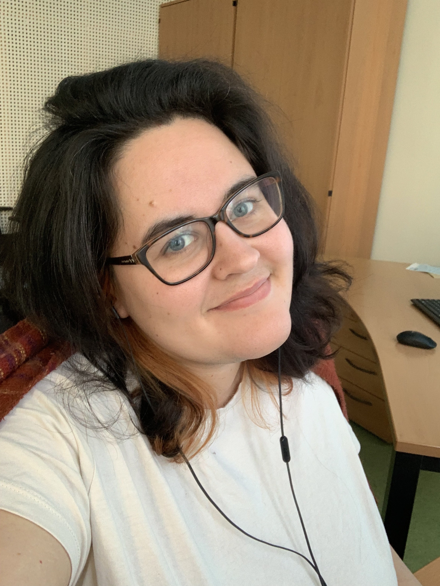

class: inverse, center, middle

```{r setup, include=FALSE}
options(htmltools.dir.version = FALSE)
```

# Introduction to Fieldwork: From elicitation to ELAN <br>
## Session 1: Introduction &nbsp;

## Naomi Peck &nbsp;

### Albert-Ludwigs-Universität Freiburg <br> 2022-02-11 (updated: `r Sys.Date()`)
&nbsp;


<!-- insert VJS logo too? figure this out -->

---

class: middle, inverse

# You can find all of the slides from this workshop at: https://naomipeck.com/project/fieldwork-workshop

### To see sources/references, open the slideshow and press "p" to activate presenter view.

???

Success!

---

class: middle

# I encourage you to use the chat during the workshop to talk with each other and ask any questions you may have!

---

# Hi!

.pull-left[
My name is Naomi Peck and I am a PhD student at the University of Freiburg, Germany.

I am writing my dissertation on the interaction of prosody and morphosyntactic structure in four languages of Northeast India.

Pre-COVID, I was planning to write a descriptive grammar of one of those languages, Kera'a. But things change!
]

.pull-right[

]

---

# Hi!

I have previously conducted two trips to the field (Dibang Valley and Lower Dibang Valley, India) and worked with a consultant of a different language at my previous university for approximately 3 years. <br><br>

--

What you'll learn today *is not* the be all end all to fieldwork. Hopefully, however, it will get you started thinking about what you'll need to do in order to work with consultants and collect data, no matter whether this be in a different country or in the next village over. 

---

# Goal

By the end of this workshop, we will have:

- collected a recording

- processed the recording, including metadata

- started the analysis of the recording

You will also have the option to further:

- submit the recording and its annotation to an archive

---

#Outline: Friday

.pull-left[
## Session One: Pre-Field
### 1400-1615

1. Introduction to course

1. What is fieldwork?

1. What data to collect?

1. Practical: Creating a data management plan

1. Going to the field
]

.pull-right[
## Session Two: In the Field
### 1645-1830

2. What is elicitation?

2. Planning a session

2. Practical: Field practice

2. Introduction to homework
]

---

#Outline: Between Sessions

##Practical Homework: In the field

1. Collect some data of your own -- with informed consent!

1. Process this data according to the DMP

---

#Outline: Saturday

.pull-left[
##Session Three: Post-Field
### 1400-1800

1. Analysing field data

1. Introduction to ELAN

1. Practical: Analysing your data in ELAN

1. Archiving the data
]

.pull-right[
##Session Four: De-briefing
### 1805-1830

2. What have you learned?

2. Other things to keep in mind

2. Final remarks
]

---

# Requirements

### Homework

- A recording device

    - Mobile phone
    
    - Computer with Audacity or Praat installed 
        
        - https://www.audacityteam.org/download/
        - https://www.fon.hum.uva.nl/praat/
    
    - Recorder with external microphone

--

### Session 3

- ELAN 6.2 or 6.3 (https://archive.mpi.nl/tla/elan/download)

- Earphones/headphones etc.

---

class: middle

###After this workshop, you should have an understanding of how to work with consultants to responsibly collect, process, analyse, and disseminate data. <br><br><br><br>

???

Fieldwork is intense but it is an incredibly rewarding process to generate one's own data in search of new knowledge. I hope that you will also feel the same after the workshop too!

---

class: inverse, middle, center

# Questions?