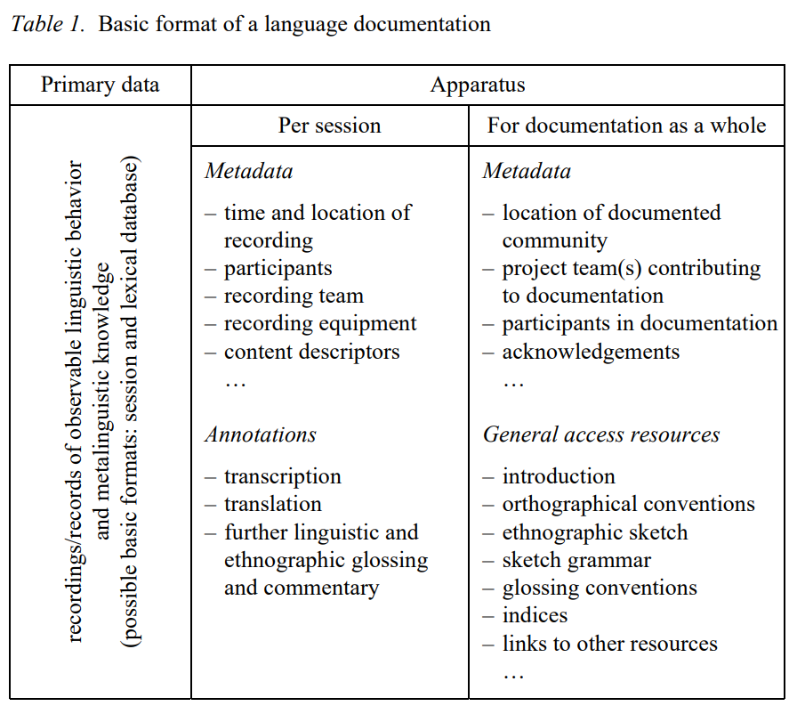

```{r, setup, include=FALSE}
library(readr)
library(leaflet)
#devtools::install_github("gadenbuie/countdown")
library(countdown)
df <- read_tsv("./81A.tsv")
options(htmltools.dir.version = FALSE)
```

class: inverse, center, middle


# Introduction to Fieldwork: From elicitation to ELAN <br>
## Session 1: What data to collect? &nbsp;

## Naomi Peck &nbsp;

### Albert-Ludwigs-Universität Freiburg <br> 2022-02-11 (updated: `r Sys.Date()`)
&nbsp;


<!-- insert VJS logo too? figure this out -->

---

class: center, middle, inverse

# What is data?

???

Himmelmann 2012 (see Further Sources) has a different categorisation of data (types), which may be more applicable for some of you. This is how I would categorise data types.

---

# Primary Data

Primary data is directly generated in the process of fieldwork. <br><br>

--

There are three main types of primary data: <br><br>

--

1. Introspective <br><br>

???

e.g. grammaticality judgment

--

2. Elicited <br><br>

???

e.g. direct translations

--

3. Observed

???

e.g. natural conversation

<!-- how does this relate to the process of recording, making notes??? -->

---

# Primary Data

These data differ according to different parameters: <br><br>

--

1. naturalistic vs. controlled <br><br>

--

2. spontaneous vs. elicited <br><br>

--

3. audiovisual vs. written

---

class: center, middle

# The Observer's Paradox

???

What is the observer's paradox?

---

# Observer's Paradox

<!-- add explanation or quote from Labov in here -->

---

# Secondary Data

Secondary data involves a level of abstraction away from primary data sources. <br><br>

--

1. Annotations (of multiple levels and formats) <br><br>

--

2. Structural analyses (syntagmatic/paradigmatic)<br><br>

--

3. Lexical data (including dictionaries)

---

# Tertiary Data

Unsurprisingly, tertiary data involves another level of abstraction from secondary data.

---

# Tertiary Data

```{r, label="wals-map", out.width='100%', fig.height=6, echo=FALSE}

#str(df)
wals <- df[,c(2:6)]
#str(wals)
wals$value <- as.factor(wals$value)
wals$description <- as.factor(wals$description)

pal <- colorFactor("viridis", domain = c(1:7))

leaflet(data = wals) %>% addTiles() %>% 
  addCircleMarkers(~longitude, ~latitude,
    popup=~name, 
    label=~description, 
    color=~pal(value),
    stroke = FALSE,
    fillOpacity = 1
  )
```

???

Data from:
Matthew S. Dryer. 2013. Order of Subject, Object and Verb. In: Dryer, Matthew S. & Haspelmath, Martin (eds.) The World Atlas of Language Structures Online. Leipzig: Max Planck Institute for Evolutionary Anthropology. (Available online at http://wals.info/chapter/81, Accessed on 2022-01-14.)

---

class: middle

# What kind of data do you want to collect? What is relevant for your research?

---

# Metadata

Metadata is data about the data you are collecting which will not necessarily become an object of your research. <br><br>

--

This could include the age and gender of who has been recorded, the location where the recording was made, or the role of a participant.<br><br>

--

This becomes very important in e.g. sociolinguistics, where demographic factors can become a relevant factor in explanation. And for those who are sociolinguists, this data is not metadata!<br><br>

--

It is also very important in interactional disciplines, where people regularly take into account situational factors in their explanation of phenomena. Whether an audience is present or not could radically influence how somebody acts.

---

# Metadata

More typical examples of metadata include:

- Identifiers of texts 

- Languages used

- Format of a file

- Description of a file

- Date of creation of a file

- Relations between files (i.e. video and audio belonging to the same recording session)

- Size of a file in bytes

- Equipment used to create a file (e.g. recording device)

---

# Metadata (Himmelmann 2006:14)

.center[
```{r out.width="70%", out.height="70%", echo=FALSE, label="Table 1 Basic format of a language documentation (Himmelmann 2006:14)"}

```
]

???

Himmelmann, Nikolaus P. 2006. Language documentation: What is it and what is it good for? In Jost Gippert, Nikolaus P. Himmelmann and Ulrike Mosel (eds.), *Essentials in Language Documentation*, 1-30. Berlin: Mouton de Gruyter.

---

class: middle

# What kind of metadata should you collect for your research project?

---

class: center, middle, inverse

# Data Collection

---

# Data Collection

It is important that whatever data we collect in the field is usable for further analyses.

This requires taking care when collecting and processing data, which we'll go into further detail into when we make a Data Management Plan together.

--

<br><br>

Before we do more "meta"-planning, let's take a look at what kinds of things we need to think about before we embark on data collection.

---

class: middle, center, inverse

# Recording

---

class: middle

> #### *Put simply, audio is presently seen as an <mark>inconvenience</mark> on the way to transcription, annotation, selection or analysis.* <br><br> (Nathan 2010:267)

???

Nathan, David. 2010. Sound and unsound practices in documentary linguistics: towards an epistemology for audio. In Peter K. Austin (ed.) *Language Documentation and Description, vol 7*, 262-284. London: SOAS.

---

<iframe width="800" height="600" src="https://www.youtube.com/embed/-XIv2ZYeh98" title="YouTube video player" frameborder="0" allow="accelerometer; autoplay; clipboard-write; encrypted-media; gyroscope; picture-in-picture" allowfullscreen></iframe>

???

Sound Speeds. 2017. "Signal to Noise Ratio - Sound Speeds" [YouTube video]. https://www.youtube.com/watch?v=-XIv2ZYeh98

---

# Tips for better recordings

1. Record for your future self listening back to the track, not for the you now!

1. Achieve the best signal (what you want to be heard) to noise (what you don't want to be heard) ratio as possible.

1. Turn off electrical equipment in the area which contributes to underlying noise.

1. Record in areas without wind and use a windscreen (sometimes called a "dead cat"!).

1. Record in areas which will not 'reflect' sound. You can dampen echoes by using lots of textiles!

1. Avoid creating extra noises when recording, such as typing or clicking a pen.

1. Monitor the recording through a pair of headphones throughout the recording or have a separate person fulfil this role.

---

# Tips for better recordings

1. Find better times to record if it is too noisy.

1. Use an external microphone: these provide much better quality audio than in-built microphones. 

1. The shorter the cord connecting the microphone to the recorder, the better.

1. Use an appropriate microphone. Unidirectional microphones (cardioid; shotgun) are good for capturing the audio of single speakers; omni- or bidirectional microphones are good for when multiple people are present.

1. Adjust your microphone placement properly so that any unidirectional microphones are pointed (roughly) at the bottom lip of a speaker. This should avoid capturing pops created by plosives.

1. Aim to keep audio recording gain at maximum -3~-6dB. A steady level of -12dB works well in my experience.

---

# Further Sources

Good, Jeff. 2022. The scope of linguistic data. In *The Open Handbook of Linguistic Data Management*, edited by Andrea L. Berez-Kroeker, Bradley McDonnell, Eve Koller, and Lauren B. Collister, 27-48. doi.org/10.7551/mitpress/12200.003.0007. Cambridge, MA: MIT Press Open.

Himmelmann, Nikolaus P. 1998. Documentary and descriptive linguistics. *Linguistics* 36:161–195.

Himmelmann, Nikolaus P. 2006. Language documentation: What is it and what is it good for? In Jost Gippert, Nikolaus P. Himmelmann and Ulrike Mosel (eds.), *Essentials in Language Documentation*, 1-30. Berlin: Mouton de Gruyter.

Himmelmann, Nikolaus P. 2012. Linguistic data types and the interface between language documentation and description. *Language Documentation and Conservation* 6:187–207.

Labov, William. 1972. *Sociolinguistic Patterns*. Philadelphia: University of Pennsylvania Press.

Nathan, David. 2010. Sound and unsound practices in documentary linguistics: towards an epistemology for audio. In Peter K. Austin (ed.) *Language Documentation and Description, vol 7*, 262-284. London: SOAS.

---

# Further Sources

Schilling, Natalie. 2013. *Sociolinguistic Fieldwork*. Cambridge: Cambridge University Press.

Schütze, Carson T. (1996) 2016. *The Empirical Base of Linguistics: Grammaticality Judgments and Linguistic Methodology*. Berlin: Language Science Press.

Seyfeddinipur, Mandana and Felix Rau. 2020. Keeping it real: Video data in language documentation and language archiving. *Language Documentation and Conservation* 14, 503-519.

Sullivant, Ryan. 2020. Archival description for language documentation collections. *Language Documentation and Conservation* 14, 520-578.

---

class: inverse, center, middle

# Short Break 

```{r, label = "clock", echo = FALSE}
countdown(minutes = 5, play_sound = TRUE, right = "34%", bottom = "20%")
```