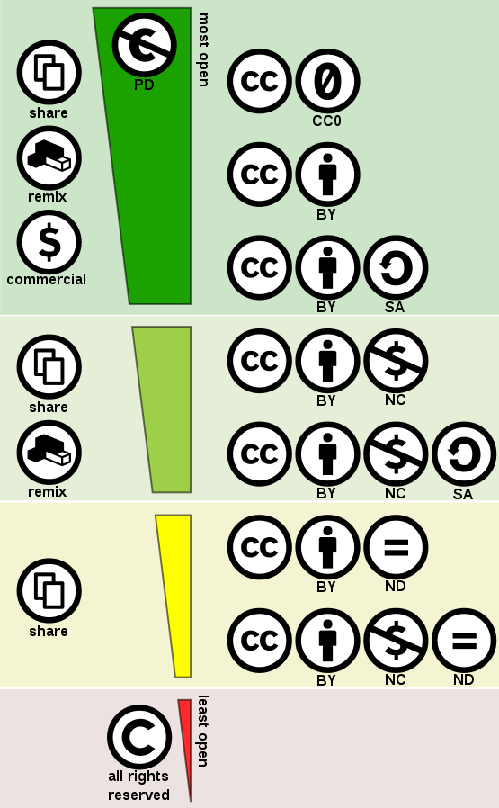

class: inverse, center, middle

```{r setup, include=FALSE}
options(htmltools.dir.version = FALSE)
#devtools::install_github("gadenbuie/countdown")
library(countdown)
```

# Introduction to Fieldwork: From elicitation to ELAN <br>
## Session 1: Creating a data management plan &nbsp;

## Naomi Peck &nbsp;

### Albert-Ludwigs-Universität Freiburg <br> 2022-02-11 (updated: `r Sys.Date()`)
&nbsp;


<!-- insert VJS logo too? figure this out -->

---

class: middle

# As part of this workshop, I mentioned that you will be making some recordings.

---

class: middle, inverse

# However, before we collect our data, we should make sure we can do so responsibly.

---

class: middle

# What should we take into account when we collect our data?

```{r echo = FALSE, label="data collection group"}
countdown(minutes = 8)
```

Discuss this question with your group and take notes in your group's shared document (links in the Shared Notes tab). Nominate one of your group members to say 3 of the things you discussed when we get back. 

???

CryptPad is a Datenschutz-friendly service.

---

class: center, middle

# Recap

--

```{r, label = "group order data", echo=FALSE}
x <- sample(1:5, 5, replace = F)
print(x)
```

---

class: center, middle

# Data Management Plans

???

This walkthrough is largely based on Kung (2019, 2022).

Kung, Susan, 2019, "Data management plans for linguistic research", https://doi.org/10.18738/T8/538EEN, Texas Data Repository, V6; Linguistics-DMP-questions.pdf 

Kung, Susan Smythe. 2022. Developing a data management plan. In The Open Handbook of Linguistic Data Management, edited by Andrea L. Berez-Kroeker, Bradley McDonnell, Eve Koller, and Lauren B. Collister, 101-116. doi.org/10.7551/mitpress/12200.003.0012. Cambridge, MA: MIT Press Open.

---

class: middle

# What is a DMP? (Mattern 2022, Kung 2022)

Data Management Plans (DMPs) are "living documents" which should be created early on within a project.

DMPs generally include:

- a description of the data that will be collected

- how the data will be compiled and analysed

- metadata and documentation of what will be produced

- the ways the data will be stored and backed up

- security and privacy protections for data

- data access policies during a project

- a long-term plan for data sharing and preservation 

???

Kung, Susan Smythe. 2022. Developing a data management plan. In The Open Handbook of Linguistic Data Management, edited by Andrea L. Berez-Kroeker, Bradley McDonnell, Eve Koller, and Lauren B. Collister, 101-116. doi.org/10.7551/mitpress/12200.003.0012. Cambridge, MA: MIT Press Open.

Mattern, Eleanor. 2022. The linguistic data life cycle, sustainability of data, and principles of solid data management. In The Open Handbook of Linguistic Data Management, edited by Andrea L. Berez-Kroeker, Bradley McDonnell, Eve Koller, and Lauren B. Collister, 61-72. doi.org/10.7551/mitpress/12200.003.0009. Cambridge, MA: MIT Press Open.

---

class: middle

> #### *... many researchers view the DMP as a burden. However, the reality is that <mark>good data management planning from the project outset can save time, money, and frustration, while ultimately helping to increase the impact of research</mark>.* <br><br>(Gabber et al. 2022)

???

Gabber, Shirley, Danielle Yarbrough, Andrea L. Berez-Kroeker, Bradley McDonnell, Eve Koller, and Lauren B. Collister. 2022. Linguistic Data Management: Online companion course to The Open Handbook of Linguistic Data Management. Website: https://sites.google.com/hawaii.edu/linguisticdatamanagement/ [Date accessed 2022/01/24].

---

class: middle, inverse

# Please open the DMP Outline (link in the Shared Notes). 

I have already filled in some (more boring) sections of the DMP.

Throughout the rest of the session, we will regularly gather in breakout rooms to discuss various points we need to address in the DMP. During these sessions, please take notes using your group's dedicated document. 

At the end of the session, we will discuss these as a larger group and finalise our group DMP.

???

CryptPad is a Datenschutz-friendly service.

---

class: center, middle

# Data Generation, Analysis, and Handling

---

class: middle

##**F**: Findable

##**A**: Accessible

##**I**: Interoperable

##**R**: Reusable

???

How could you apply these concepts to your own data?

---

# FAIR Guiding Principles (Wilkinson et al. 2016)

<!-- insert box 2 from FAIR article -->

.center[

]

???

Wilkinson, Mark D., Michel Dumontier, IJsbrand Jan Aalbersberg, Gabrielle Appleton, Myles Axton, Arie Baak, Niklas Blomberg, et al. 2016. The FAIR Guiding Principles for scientific data management and stewardship. *Scientific Data* 3(1). 160018. https://doi.org/10/bdd4.

What do you think FAIR data and metadata means for you and your research?

---

# File Formats

.pull-left[
## Gold Standard
### Open File Formats
supported by many developers; can be used by multiple applications
**Examples**: .pdf, .txt, .csv, .png, .xml
### Lossless File Formats
does not lose information when compressed or made smaller
**Examples**: .wav, .pdf, .png
]

.pull-right[
## Avoid Where Possible
### Proprietary File Formats
supported by one developer; dependent on one application
**Examples**: .rar, .flextext, .avi
### Lossy File Formats
loses information when compressed or made smaller<br>
**Examples**: .mp3, .jpg, .mp4
]

---

class: middle

> #### *Remember, friends don't let friends save phonetic data in lossy formats (e.g., .mp3, AAC, .wmv)!* <br><br>(Styler 2017:57)

???

Styler, Will. 2021. *Using Praat for Linguistic Research*, version 1.8.3. Last updated March 10, 2021. http://wstyler.ucsd.edu/praat/

---

# Data Generation, Analysis and Handling

In groups, discuss the following:

1. What type of data will we produce 'in the field'?

1. What format should this be created and stored in?

1. Will we make any analog data? If so, how should we digitise this?

1. What equipment, software and/or other tools do we need to generate the data?

1. What equipment, software and/or other tools do we need to analyse the data?

```{r generation, echo = FALSE}
countdown(minutes = 10)
```

---

class: center, middle

# Legalities and Ethics of Data Generation

---

class: middle, center, inverse

# Who does data belong to?

---

class: middle, center

## Disclaimer: I am not a lawyer. 

### Different countries follow different copyright laws and you should always make sure to doublecheck what applies to your situation. This advice is primarily intended for those in the EU (specifically Germany).

---

# Copyright and Data

In Germany, you automatically have rights as an author to your work through its creation and do not need to register it. This includes right of reproduction, distribution, and use, and various moral rights. These rights can only be transferred to a third party through inheritance. Copyright lasts your lifetime + 70 years. 

Anyone who you record also obtains joint rights to the recording under German copyright law as either an author or as a performer. People involved in the data collection process should understand their rights before recording. This should ideally form part of your informed consent process.

???

Act on Copyright and Related Rights (Urheberrechtsgesetz - UrhG) https://www.gesetze-im-internet.de/englisch_urhg/index.html

Copyright Act of 9 September 1965 (Federal Law Gazette I, p. 1273), as last amended by Article 1 of the Act of 28 November 2018 (Federal Law Gazette I, p. 2014)

See also: https://www.meissnerbolte.de/fileadmin/user_upload/pdf/publikationen/lexology_copyright_2020.pdf

Directive 96/9/EC of the European Parliament and of the Council of 11 March 1996 on the legal protection of databases, https://eur-lex.europa.eu/legal-content/EN/ALL/?uri=CELEX:31996L0009

--

There is no doctrine of "Fair Use/Handling" or "Work Made for Hire" in Germany, like there is in many Anglosphere countries. Lawfully permitted uses are instead outlined in the UrhG, which includes scientific research.

--

If you create a database in the EU (such as a collection of your data), you also have *sui generis* rights under the Database Directive. These rights last for 15 years from the publication or "completion" of your database, and is renewed upon a substantial addition/alteration of the database.

---

class: middle, inverse, center

# What is legally possible may not be ethically right.

---

# Privacy of Data

In the EU, we are required to abide by the GDPR. This means we must be careful when dealing with personal data, which inevitably impacts how we go about data collection. Even anonymising counts as processing personal data.

Unfortunately for us, recording audiovisual data is something we rarely anonymise.

As such, it is incredibly important to collect the explicit consent of those who you work with when applicable.

--

You may end up collecting sensitive data during fieldwork. Sensitive data is defined as:

> *“personal data revealing racial or ethnic origin, political opinions, religious or philosophical beliefs, or trade union membership, and the processing of genetic data, biometric data for the purpose of uniquely identifying a natural person, data concerning health or data concerning a natural person's sex life or sexual orientation”*

You need to be especially careful when dealing with this type of data and should consider the potential risks to those being recorded when publishing such data.

???

Consult the Data Protection Officer at your university if you think you may collect sensitive data.

Quinn, Paul. 2021. Research under the GDPR – a level playing field for public and private sector research? *Life Sciences, Society and Policy* 17, 4. https://doi.org/10.1186/s40504-021-00111-z

REGULATION (EU) 2016/679 OF THE EUROPEAN PARLIAMENT AND OF THE COUNCIL of 27 April 2016 on the protection of natural persons with regard to the processing of personal data and on the free movement of such data, and repealing Directive 95/46/EC (General Data Protection Regulation), https://eur-lex.europa.eu/legal-content/EN/TXT/?uri=CELEX%3A02016R0679-20160504

---

# Privacy of Data: Some tips

1. Be fair and transparent about your research.

1. Be mindful of power differences. Make sure that any consent is collected voluntarily.

1. Different countries have different ethical and legal requirements for conducting fieldwork. You should make sure to abide by ethical and legal standards both at your home institution and in your field community.

1. Informed consent can be oral or written, depending on what is most appropriate. 

1. All forms of taking informed consent should be done in clear and simple language.

1. Make sure to say how personal data will be processed and how long it will be stored for, as well as which purposes the personal data will and will not be used for.

1. Consent is not explicitly required under the GDPR for archiving or scientific research. However, it is ethically wrong to archive recordings of people without their consent.

???

See also: https://iapp.org/news/a/how-gdpr-changes-the-rules-for-research/

See also: https://www.ukri.org/wp-content/uploads/2020/10/UKRI-020920-GDPR-FAQs.pdf

---

class: center, middle, inverse

# Who is creating the data?

---

class: middle

##**C**: Collective Benefit

##**A**: Authority to Control

##**R**: Responsibility

##**E**: Ethics

???

Who do you think traditional data processes normally benefit? Who should be able to control what data is produced?

Carroll, Stephanie Russo, Ibrahim Garba, Oscar L. Figueroa-Rodríguez, Jarita Holbrook, Raymond Lovett, Simeon Materechera, Mark Parsons, et al. 2020. The CARE Principles for Indigenous Data Governance. *Data Science Journal* 19. 43. https://doi.org/10/gh6dvb.

---

# CARE Principles for Indigenous Data Governance (Carroll et al. 2020:5)

.center[
```{r out.width="55%", out.height="55%", echo=FALSE, label="Figure 2: The CARE Principles of Indigenous Data Governance (Carroll et al. 2020:5)", fig.alt="Figure 2: The CARE Principles of Indigenous Data Governance (Carroll et al. 2020:5)"}

```
]

???

Carroll, Stephanie Russo, Ibrahim Garba, Oscar L. Figueroa-Rodríguez, Jarita Holbrook, Raymond Lovett, Simeon Materechera, Mark Parsons, et al. 2020. The CARE Principles for Indigenous Data Governance. *Data Science Journal* 19. 43. https://doi.org/10/gh6dvb.

---

class: middle

##**R**: relationships

##**R**: responsibility

##**R**: respect

##**R**: reciprocity

##**R**: rights and regulations
 
##**R**: relevance

##**R**: reflexivity as researchers

???

Snow, Kevin C., Danica G. Hays, Guia Caliwagan, David J. Ford Jr., Davide Mariotti, Joy Maweu Mwendwa, and Wendy E. Scott. 2016. Guiding principles for indigenous research practices. Action Research 14 (4): 357–375. https://doi.org/10.1177/1476750315622542.

For a linguistic perspective on indigenous data governance, see:
Holton, Gary, Wesley Y. Leonard, and Peter L. Pulsifer. 2022. Indigenous peoples, ethics, and linguistic data. In The Open Handbook of Linguistic Data Management, edited by Andrea L. Berez-Kroeker, Bradley McDonnell, Eve Koller, and Lauren B. Collister, 49-60. doi.org/10.7551/mitpress/12200.003.0008. Cambridge, MA: MIT Press Open.

---

# Legalities and Ethics

1. Take a look at the [Traditional Knowledge Labels](https://localcontexts.org/labels/traditional-knowledge-labels/). Would any of these apply to our data?

1. Will any of the data we collect need to be kept private, confidential, or restricted? Why?

1. One of the *R*-words is reciprocity. How can we give back to those who help us collect data?

1. How can we balance open access principles with legal and ethical concerns?

```{r ethics, echo = FALSE}
countdown(minutes = 10)
```

---

class: center, middle

# Data Storage, Backup, and Security

---

# Back-ups

With larger documentation projects, the space required for back-up can rack up quickly. For example, the size of a 10 minute recording can differ radically between formats. A lossy .mp3 is only 5MB, but a lossless .wav is 50MB and lossy SD .mpg is 100MB. Good quality data is an investment in more than one sense.

--

### Regularly check your back-ups!

Even if you have your data backed-up, it is always possible that something could happen to it. Your portable HD could become corrupted or you could have your apartment burn down (true story). Make sure to regularly evaluate if everything works!

---

# Backing-up in the field

When you're at a remote field site, making sure your data is safe and secure can be very difficult. 

Make sure to take extra hard drives, memory cards, and potentially even a CD writer and empty CDs. You should also have waterproof bags to keep them safe!

Many fieldworkers will try to back their data up on an online cloud-service if they have access, but you should be careful that the service you use complies with GDPR. In other places, the internet access is too spotty or slow for this to work.

---

# Back-ups

## 3-2-1 Rule

**3** copies of data on **2** storage media with **1** copy in an off-site location

## LOCKSS

**L**ots of **C**opies **K**eep **S**tuff **S**afe

---

# Data Storage and Security

Take a look at the [information sheet](https://sustainableheritagenetwork.org/system/files/atoms/file/EstimatingStorageRequiredForAudio.pdf) from The Sustainable Heritage Network.

Your homework today will be to make a 3-5 minute long recording. Assuming that everyone makes a 5 minute stereo .wav recording with 16-bit depth and 44.1 kHz sampling rate, how big would our collection be? How big would our collection be if we each recorded an hour?

Now take a look at the [Calculation model for costs of (digital) storage](https://zenodo.org/record/4033087#.YfWS_f7MKUk) from Rob Hooft. How much would it cost us to host the small repository for 10 years? What about the large one for 70 years? Make sure to select the appropriate options for our data.

```{r backups, echo = FALSE}
countdown(minutes = 8)
```

???

The included resources here are licensed under [CC-BY](https://creativecommons.org/licenses/by/4.0/legalcode).

---

class: center, middle

# Documentation and Metadata

---

# Naming Files

### All files must be named!

You are about to watch a video from AILLA which introduces the concept of filenaming for archiving. As you watch, think about what might be useful for our data collection purposes.

---

class: middle, center

<iframe width="800" height="600" src="https://www.youtube.com/embed/c-Mcp5ozgx0" title="YouTube video player" frameborder="0" allow="accelerometer; autoplay; clipboard-write; encrypted-media; gyroscope; picture-in-picture" allowfullscreen></iframe>

???

AILLA Archive of the Indigenous Languages of Latin America. 2018. "Filenaming" [YouTube Video]. https://www.youtube.com/watch?v=c-Mcp5ozgx0  

https://corsal.unt.edu/32-file-naming could also be useful for you.

---

# Naming Files

What elements do we need in our filenames? Decide on four.

```{r naming, echo = FALSE}
countdown(minutes = 5)
```

???

Things to keep in mind:
- filenames must be unique
- sessions should share the same filename
- filenaming for one data collection purpose may not be relevant for another purpose

---

# Metadata

Take a look at the metadata conventions for two archives, [ELAR](https://elararchive.org/blog/2020/04/30/introducing-lameta/) and [CORSAL](https://corsal.unt.edu/34-information-needed-files).

What metadata do they require on an item level? What metadata do they require on a session level?

What information do you think we should minimally include in the metadata for our collection?

```{r echo = FALSE, label="metadata countdown"}
countdown(minutes = 10)
```

???

Computational Resource for South Asian Languages. (2020). Collaborative Language Archiving Curriculum. Retrieved 2022-01-14 from https://corsal.unt.edu/curriculum. 

---

class: center, middle

# Data Dissemination, Preservation, and Sharing

---

# Copyright

Not only do we have to consider copyright in the collection of data, but also in its dissemination. Open access encourages more open licenses.

.center[
```{r out.width="30%", out.height="30%", echo=FALSE, label="Creative commons license spectrum", fig.alt="Creative commons license spectrum between public domain (top) and all rights reserved (bottom). Left side indicates the use-cases allowed, right side the license components. The dark green area indicates Free Cultural Works compatible licenses, the two green areas compatibility with the Remix culture. The bright green area alone can be seen as similar to the 'fair use' concept, and the yellow area to the 'freeware' concept."}

```
]

Try out the [License Chooser](https://creativecommons.org/choose/) offered by Creative Commons to see which kind of license you may want to use.

???

Image sourced from Wikipedia Commons, original author Shaddim; original CC license symbols by Creative Commons. Image is licensed under [CC-BY](https://creativecommons.org/licenses/by/4.0/deed.en).
https://en.wikipedia.org/wiki/File:Creative_commons_license_spectrum.svg

---

# Archives

There are a number of archives which accept linguistic data around the world. Many have a focus on languages from specific areas; others have a focus on certain subdisciplines. Here are just a few.

.pull-left[
### Language Documentation Archives
- ELAR
- PARADISEC
- AILLA
- CORSAL
- World Oral Literature Project
- Language Archive Cologne
- Pangloss Collection
- ...
]

.pull-right[
### Other Archives
- Zenodo
- Institutional Data Repositories
- ...
]

---

# Archives

The archive that we will be depositing in for this workshop is Zenodo. As a group, choose an archive from the previous list, and answer the following questions:

1. Who has access to this digital repository?

1. What types of files does the archive accept?

1. What metadata is required by the archive?

1. What copyright license does the archive use? (e.g. CC0, CC-BY...)

1. What are the potential costs associated with archiving and long-term preservation of data?

1. What levels of access to the data are possible?

1. How does the speech community influence the archival process?

```{r archive, echo = FALSE}
countdown(minutes = 10)
```

---

class: middle

# Regulations on sharing data also apply in e-mails!

---

class: center, middle

# Timeline and Responsibilities

---

# Timeline and Responsibilities

When managing a project, you should ideally include in your plan a timeline of when certain tasks should be achieved.

--

For the purposes of this project, I am responsible for implementing and overseeing the DMP.

If you wish to archive your data as part of this workshop, there are a few deadlines:

1. Telling me that you wish to archive: <mark>13 February 2022</mark> (end of this week)

1. Submission of primary data and metadata: <mark>28 February 2022</mark> (before Carnival)

1. Submission of secondary data: <mark>24 April 2022</mark> (before start of SoSe)

Please send me an email if you are interested and I will give you more details about what is required.

---

class: middle

> *... the best data management strategy is one that the researcher is able to consistently employ throughout the research life cycle.* <br><br> (Mattern 2022:69)

???

Mattern, Eleanor. 2022. The linguistic data life cycle, sustainability of data, and principles of solid data management. In *The Open Handbook of Linguistic Data Management*, edited by Andrea L. Berez-Kroeker, Bradley McDonnell, Eve Koller, and Lauren B. Collister, 61-72. doi.org/10.7551/mitpress/12200.003.0009. Cambridge, MA: MIT Press Open.

---

# Further Sources

Collister, Lauren B. 2022. Copyright and sharing linguistic data. In The Open Handbook of Linguistic Data Management, edited by Andrea L. Berez-Kroeker, Bradley McDonnell, Eve Koller, and Lauren B. Collister, 117-128. doi.org/10.7551/mitpress/12200.003.0013. Cambridge, MA: MIT Press Open.

Computational Resource for South Asian Languages. (2020). Collaborative Language Archiving Curriculum. Retrieved 2022-01-14 from https://corsal.unt.edu/curriculum. 

Holton, Gary, Wesley Y. Leonard, and Peter L. Pulsifer. 2022. Indigenous peoples, ethics, and linguistic data. In The Open Handbook of Linguistic Data Management, edited by Andrea L. Berez-Kroeker, Bradley McDonnell, Eve Koller, and Lauren B. Collister, 49-60. doi.org/10.7551/mitpress/12200.003.0008. Cambridge, MA: MIT Press Open.

Kung, Susan Smythe. 2022. Developing a data management plan. In The Open Handbook of Linguistic Data Management, edited by Andrea L. Berez-Kroeker, Bradley McDonnell, Eve Koller, and Lauren B. Collister, 101-116. doi.org/10.7551/mitpress/12200.003.0012. Cambridge, MA: MIT Press Open.

---

# Further Sources

Mattern, Eleanor. 2022. The linguistic data life cycle, sustainability of data, and principles of solid data management. In The Open Handbook of Linguistic Data Management, edited by Andrea L. Berez-Kroeker, Bradley McDonnell, Eve Koller, and Lauren B. Collister, 61-72. doi.org/10.7551/mitpress/12200.003.0009. Cambridge, MA: MIT Press Open.

Sullivant, Ryan. 2020. Archival description for language documentation collections. *Language Documentation and Conservation* 14, 520-578.

Wilkinson, Mark D., Michel Dumontier, IJsbrand Jan Aalbersberg, Gabrielle Appleton, Myles Axton, Arie Baak, Niklas Blomberg, et al. 2016. The FAIR Guiding Principles for scientific data management and stewardship. *Scientific Data* 3(1). 160018. https://doi.org/10/bdd4.

---

class: inverse, center, middle

# Short Break

```{r break, echo = FALSE}
countdown(minutes = 5, play_sound = TRUE, right = "34%", bottom = "20%")
```