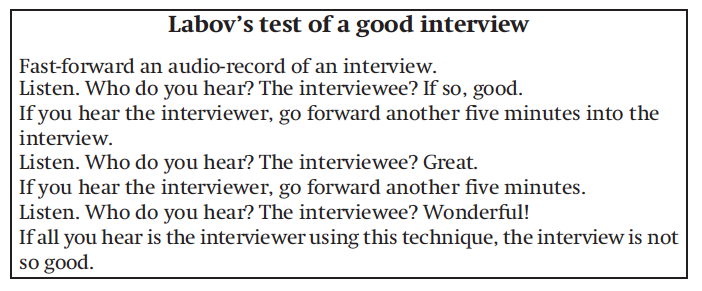

```{r, setup, include=FALSE}
library(countdown)
options(htmltools.dir.version = FALSE)
```

class: inverse, center, middle


# Introduction to Fieldwork: From elicitation to ELAN <br>
## Session 2: What is elicitation? &nbsp;

## Naomi Peck &nbsp;

### Albert-Ludwigs-Universität Freiburg <br> 2022-02-11 (updated: `r Sys.Date()`)
&nbsp;


<!-- insert VJS logo too? figure this out -->

---

class: center, middle, inverse

# What is elicitation?

---

<!-- refer to Gunter Senft's article to pull out a definition -->

---

# Observer's Paradox

> #### To obtain the data most important for linguistic theory, we have to observe how people speak when they are not being observed. <br><br> (Labov 1972:113)

???

Labov, William. 1972. Some principles of linguistic methodology. *Language in Society* 1, 97-120.

--

To get around the observer's paradox, aim to ask questions which prompt unreserved reactions or engage your consultants in the data collection process, so they become collaborators rather than 'lab rats'.

--

Do not go out and just try to get people to say "fourth floor"!

---

# Discussion

We have only discussed ethics around the overall data collection process. What kind of ethical concerns should we be aware of when working directly with speakers?

<!-- insert clock -->

???

ethics of speakers may be different, power dynamics of researcher and consultants, different relationship to language than Westerners; respect between consultants and researcher is paramount; respect each others time; respect the effort given

---

class: middle, center, inverse

# Elicitation Techniques

---

# Translation: Word Lists

Collecting word lists is one of the first thing any descriptive linguist does in the field. It helps us figure out what kind of sound system we're dealing with and basic syntactic information, while helping us compile a lexical database.

It is very simple: you ask a consultant "how would you say/sign X in your language?"

--

**Bonus**: Be flexible! Let your consultant tell you related words. Perhaps you'll find out about something culturally important you can ask about later?

---

# Tips for Word Lists

To get consistent phonetic data, you should also formulate some frame sentences. 

The ideal frame sentence is one where the target word is utterance-medial and surrounded by voiceless stops. If you can't get voiceless stops, then get voiced stops. The next best thing would be a nasal or a low vowel.  If you are working with a tonal language, make sure to take this into account too.

<!-- insert figure from elicitation in Himalayan language - Gawne or Hyslop?  -->

---

# Examples of Word Lists

Word lists can be general, comparative, or domain-specific. Here are some examples you can refer to:

.pull-left[
### General
Swadesh List (Swadesh 1955)

Leipzig-Jakarta List (Haspelmath and Tadmor 2009)
]

.pull-right[
### Area- or Family-specific
STEDT (SE/E Asia) (Matisoff 1989)

SIL Comparative African wordlist (Snider and Roberts 2006)

Wordlist for North American languages (Powell 1880)

Wordlist for Australian languages (Sutton and Walsh 1979)
]

???

Haspelmath, Martin and Uri Tadmor (eds.), 2009. *Loanwords in the World’s Languages: A Comparative Handbook*. Berlin and New York: Mouton de Gruyter.

The list can be found here: http://udel.edu/~pcole/fieldmethods2010/The%20Leipzig-Jakarta%20Word%20List.pdf

Matisoff, James, 1989. STEDT Animal Questionnaire

Matisoff, James, 1989. STEDT Body Parts Questionnaire

Matisoff, James, 1989. STEDT Kinship Terms and Terms referring to People Questionnaire

Matisoff, James, 1989. STEDT Natural Objects Questionnaire

Matisoff, James, 1989. STEDT Plants Questionnaire

Powell, John Wesley. 1880. Chapter III: Schedules. in Introduction to the Study of Indian Languages. Washington: Government Printing Office. pp. 77-228

Snider, Keith and Roberts, James (2004) SIL Comparative African Word List (SILCAWL). The Journal of West African Languages 31.2, 73-122.

Snider, Keith and Roberts, James. 2006. SIL Comparative African wordlist (SILCAWL). SIL International, https://www.sil.org/resources/publications/entry/7882

Sutton, Peter and Walsh, Michael. 1979. "AIAS wordlist for Australian languages". in Revised Linguistic Fieldwork manual for Australia. Canberra: Australian Institute of Aboriginal Studies. pp.37-53

Swadesh, Morris, 1955, "Towards Greater Accuracy in Lexicostatistic Dating", in : International Journal of American Linguistics, Vol. 21, No. 2 (Apr., 1955), pp. 121-137

---

# Translation: Linguistic Structure

It is also possible to use the translation technique to get some initial insights into linguistic structures. This could involve testing phonotactics or grammatical structures.

**Phonotactics**: "Is there a word like *snaf* in your language?"

**Grammar**: "What would you say if there was more than one *snaf*?" "Could you say *snafs*?"

Sometimes you end up discovering words that you would have never thought of asking for beforehand with this technique!

--

You do have to be careful, however, of any kind of transfer or priming. This technique works best for simple phenomena and does not work well if you are looking for more unusual or pragmatically marked phenomena.

--

You should not ask after analytical categories either - how many speakers know how many consonants are in the language they speak?!?

???

Chelliah in Podesva and Sharma

---

# Translation: Text Translation

After you have collected a text, you can work with speakers/signers of a language to work on transcribing and translating a text.

Play back a small section of a recorded text. Ask your consultant to pronounce it again slowly and transcribe it together. Ask for how they would translate it as whole, then ask after the meaning of single words. The consultant may offer extra information about the context or words within a text - these insights are often incredibly valuable.

If you are interested in how what you learn contrasts with what you've already encountered, you can use the text as stimuli for further elicitation of linguistic structure. 

???

Chelliah, Shobhana L. 2001. The role of text collection and elicitation in linguistic fieldwork. In Paul Newman and Martha Ratliff (eds.), *Linguistic Fieldwork*, 152-165. Cambridge: Cambridge University Press.

---

# Grammatical Judgements

These are perhaps better termed *acceptability* judgements, as any judgement necessarily involves pragmatic acceptability.

--

This type of data is similar to introspection, in that it is highly dependent on a speaker's opinion. That said, it is incredibly valuable in collecting *negative* data, i.e. what *cannot* be said. You should simply be  careful in the interpretation of the data.

---

# Collecting Grammatical Judgements

Start with a hypothesis about a given language structure: "is there a structural difference between pronominal *what* and adjectival *which*?"

Construct multiple sentences to test this hypothesis:

1. "What did you claim that John bought?" "Which book did you claim that John bought?"

1. "What did you make the claim that John bought?" "Which book did you make the claim that John bought?"

Ask your consultant which feels more natural to say.

See if you can substitute words in the sentences and for them to still be grammatical/acceptable.

--

**Bonus**: Ask your consultant about other ways they could say the same thing. 

--

**Bonus**: Ask if a different phrasing means something different or would be used in a different context.

???

Schütze, Carson T. (1996) 2016. *The Empirical Base of Linguistics: Grammaticality Judgments and Linguistic Methodology*. Berlin: Language Science Press.

Schütze and Sprouse, Chelliah in Podesva and Sharma

---

# Grammatical Judgements

Here are some suggestions of things you could elicit or test using this technique:

- grammatical paradigms

- scope of operators

- tense and aspect

- ...

???

Chelliah in Podesva and Sharma

---

# Tips for Grammatical Judgements

Be very careful about how you elicit this data - asking for multiple grammatical judgements in a row often leads to confusion or fatigue. This can result in a consultant trying to give you the answer you want in an effort to finish as quickly as possible!

Beware of syntactic priming! It is best to try and get this data multiple times from the same person or different people to try and mitigate effects the fieldworker may have had on the data.

If doing language description, there are a lot of typological questionnaires out there which can give you advice on which grammatical features to try to elicit. A classic is Comrie and Smith 1977.

Grammatical judgements do not give you information about the frequency of a construction or when the construction would be acceptable. Consider complementing this data with corpus work.

???

Comrie Bernard, and Norval Smith. 1977. "Lingua descriptive studies: questionnaire". Lingua 42:1-72

---

# Text Elicitation

More naturalistic data can be collected if you ask a speaker to tell a story. This can be useful for finding structures you may not have otherwise found through questionnaire-based techniques, which can then be used for further testing.

Certain stimuli are also used to elicit running text which is then comparable across languages. While less naturalistic, this data too has its place in fieldwork.

---

# Genres of Narrative

- Personal narratives: "Could you introduce yourself?" "Tell me about a recent hunting trip."

- Historical narratives: "Could you tell me about the history of your tribe?"

- Folktales: "Do you know a story about the boogeyman?"

- Procedural texts: "Can you tell me how to weave a basket?"

---

# Stimuli (Narratives)

- Pear Story (Chafe 1980)

- Frog Story (source)

- North Wind and the Sun (source)

- The Jackal and the Crow (Carroll, Kelly and Gawne 2011)

- Family Problems (source)

- Cut and Break (Bohnemeyer et al. 2001)

- Put Project (Bowerman et al. 2004)

???

Bohnemeyer, J., Bowerman, M., & Brown, P. 2001. Cut and break clips. In S. C. Levinson, & N. J. Enfield (Eds.), Manual for the field season 2001, 90-96. Nijmegen: Max Planck Institute for Psycholinguistics. doi:10.17617/2.874626

owerman, M., Gullberg, M., Majid, A., & Narasimhan, B. (2004). Put project: The cross-linguistic encoding of placement events. In A. Majid (Ed.), Field Manual Volume 9 (pp. 10-24). Nijmegen: Max Planck Institute for Psycholinguistics. doi:10.17617/2.492916.

Chafe, Wallace (ed.). 1980. The Pear Stories: Cognitive, Cultural and Linguistic Aspects of Narrative Production. Norwood, NJ: Ablex. [Now available from Greenwood Press: Westport, CT.)

Carroll, Alice, Barbara Kelly & Lauren Gawne. 2011. The jackal and crow picture task. Designed for use by the Social Cognition and Language Project. A collaboration of The Australian National University, Griffith University, University of Melbourne and the Max Planck Institute for Psycholinguistics.

---

# Sociolinguistic Interview

The sociolinguistic interview is a technique used to mitigate observer effects by posing the interviewer as an interested interlocutor or friend. The aim is to elicit vernacular speech from the interviewee, rather than collect any information in particular.

The recordings are overtly conducted but topics are general and interviewees are encouraged to talk as freely as possible. The topics should additionally be localised to the community context. This results in relatively high quality conversational data.

This technique works best in a monolingual format; consider enlisting the help or training a native speaker interviewer if needed in the field.

???

Massive thanks to Miriam Neuhausen for teaching me a lot about how sociolinguists conduct fieldwork. A lot of the material you see here is thanks to her; all misunderstandings are my own!

---

# Conducting a Sociolinguistic Interview

Begin with talking about social factors you need for your data analysis: "Where were you born?" "What year were you born in?"

--

Think about what topics you may want information around. Structure your interview from more general impersonal questions and then move to more specific personal questions.

--

For example: 

"Did you have a chance to go to school?" "What was your favourite subject?"

--

"Did something ever happen on the way to school?" "Did the teacher ever punish you for something you didn't do?"

--

Finally, if you wish, you can ask language-related questions: "How did the children from X speak? How was it different to how you speak?"

You can also administer a word list or reading exercise to elicit target forms. This portion of the interview reflects a more self-conscious style, as attention is drawn to the language of the interviewee.

???

Massive thanks to Miriam Neuhausen for teaching me a lot about how sociolinguists conduct fieldwork. A lot of the material you see here is thanks to her; all misunderstandings are my own!

---

# Sociolinguistic Interview (Tagliamonte 2006:39)

.center[

]

???

Tagliamonte, Sali A. 2006. *Analysing Sociolinguistic Variation*. Cambridge: Cambridge University.

---

# Field Experiments

It is possible to do more complicated experiments in the field (although I haven't tried it myself). Here is a short list of some of the potential experiments you may be able to do in the field (see Sources for references).

.pull-left[
### Phonetic
- palatography
- linguography
- measuring air flow and pressure
]

.pull-right[
### Cognitive
- Eric's Maze Task
- Hidden Colour-Chips Task: demonstratives, attention, and interaction
]

???

Maddieson, Ian. 2001. In Paul Newman and Martha Ratliff (eds.), *Linguistic Fieldwork*, 211-229. Cambridge: Cambridge University Press.

Eric's Maze Task: http://hdl.handle.net/21.11116/0000-0002-57B1-4
Hidden Colour-Chips Task: http://hdl.handle.net/11858/00-001M-0000-0011-548E-E

---

class: middle, center, inverse

# Recording the Data

---

class: middle

> #### *Put simply, audio is presently seen as an <mark>inconvenience</mark> on the way to transcription, annotation, selection or analysis.* <br><br> (Nathan 2010:267)

???

Nathan, David. 2010. Sound and unsound practices in documentary linguistics: towards an epistemology for audio. In Peter K. Austin (ed.) *Language Documentation and Description, vol 7*, 262-284. London: SOAS.

---

<iframe width="800" height="600" src="https://www.youtube.com/embed/-XIv2ZYeh98" title="YouTube video player" frameborder="0" allow="accelerometer; autoplay; clipboard-write; encrypted-media; gyroscope; picture-in-picture" allowfullscreen></iframe>

???

Sound Speeds. 2017. "Signal to Noise Ratio - Sound Speeds" [YouTube video]. https://www.youtube.com/watch?v=-XIv2ZYeh98

---

# Tips for better recordings

1. Record for your future self listening back to the track, not for the you now!

1. Turn off electrical equipment in the area which contributes to underlying noise.

1. Record in areas without wind and use a windscreen (sometimes called a "dead cat"!).

1. Record in areas which will not 'reflect' sound. You can dampen echoes by using lots of textiles!

1. Avoid creating extra noises when recording, such as typing or clicking a pen.

1. Monitor the recording through a pair of headphones throughout the recording or have a separate person fulfil this role.

1. Find better times to record if it is too noisy.

---

# Tips for better recordings

1. Make sure your microphone is steady and will not move around. Consider using a tripod or mount if needed.

1. Use an external microphone: these provide much better quality audio than in-built microphones. 

1. The shorter the cord connecting the microphone to the recorder, the better.

1. Use an appropriate microphone. Unidirectional microphones (cardioid; shotgun) are good for capturing the audio of single speakers; omni- or bidirectional microphones are good for when multiple people are present.

1. Adjust your microphone placement properly so that any unidirectional microphones are pointed (roughly) at the bottom lip of a speaker. This should avoid capturing pops created by plosives.

1. Aim to keep audio recording gain at maximum -3~-6dB. Clipping occurs at 0dB.

---

# Best recording practice

- Test your sound levels before starting and adjust them as needed.

- Always doublecheck you are recording before you start.

- Make a sharp, loud noise (e.g. a clap) in front of the microphone to indicate the start of a recording. This is incredibly helpful for syncing multiple audiovisual streams.

- Briefly list relevant metadata at the start of the recording (e.g., purpose of recording, who is recording, who will be speaking/signing, date of recording, location).

- Continue monitoring your sound quality throughout the recording.

- Prompt your speaker/signer, but do not interrupt them. You want to collect their data, not yours!

- Briefly summarise your session or get your speaker to do so before ending your recording.

- Fill out your metadata and backup and rename your files as soon as possible after sessions.

---

class: middle, center

# Always have spare batteries for your recorder! 

Batteries are a part of every good fieldworker's toolkit.

---

# Further Sources

Deborah Cameron et al. 1992 Researching Language

Chelliah in Newman and Ratliff

Labov, William. 1972. *Sociolinguistic Patterns*. Philadelphia: University of Pennsylvania Press.

Mansfield, J., & Stanford, J. N. (2017). Documenting Sociolinguistic Variation in Lesser-Studied Indigenous Communities: Challenges and Practical Solutions. *Language Documentation & Conservation Special Publication*, 13, 116–136.

Nathan, David. 2010. Sound and unsound practices in documentary linguistics: towards an epistemology for audio. In Peter K. Austin (ed.) *Language Documentation and Description, vol 7*, 262-284. London: SOAS.

---

# Further Sources

Podesva and Sharma

Sakel, Jeanette, and Daniel L. Everett. 2012. *Linguistic fieldwork: A student guide*. Cambridge: Cambridge University Press.

Schilling, Natalie. 2013. *Sociolinguistic Fieldwork*. Cambridge: Cambridge University Press.

Schütze, Carson T. (1996) 2016. *The Empirical Base of Linguistics: Grammaticality Judgments and Linguistic Methodology*. Berlin: Language Science Press.

Seyfeddinipur, Mandana and Felix Rau. 2020. Keeping it real: Video data in language documentation and language archiving. *Language Documentation and Conservation* 14, 503-519.

Sullivant, Ryan. 2020. Archival description for language documentation collections. *Language Documentation and Conservation* 14, 520-578.

Tagliamonte, Sali A. 2006. Analysing Sociolinguistic Variation. Cambridge: Cambridge University.

http://tulquest.huma-num.fr/

---

class: inverse, center, middle

# Short Break 

```{r, label = "clock", echo = FALSE}
countdown(minutes = 5, play_sound = TRUE, right = "34%", bottom = "20%")
```