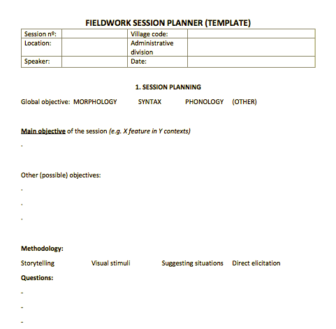

```{r, setup, include=FALSE}
library(countdown)
options(htmltools.dir.version = FALSE)
```

class: inverse, center, middle


# Introduction to Fieldwork: From elicitation to ELAN <br>
## Session 2: Planning a session &nbsp;

## Naomi Peck &nbsp;

### Albert-Ludwigs-Universität Freiburg <br> 2022-02-11 (updated: `r Sys.Date()`)
&nbsp;


<!-- insert VJS logo too? figure this out -->

---

class: middle, inverse

# Before we conduct any elicitation sessions, we should first make a plan.

---

class: center, middle

> ####*Think hard first, record later.*<br>-- Peter Ladefoged<br><br>(Sakel and Everett 2012:113)

???

source

---

# Planning a Session

Having a plan of what to do before working with your consultants is invaluable. It helps you think through what data you need to test and collect, making the time you spend together more worthwhile.

Plans can also help you if you do not have any idea of what to do. Having a few 'back-up' sessions planned, e.g., collecting word lists or topics for an interview, means that you always have something to fall back upon if you do not have any other hypotheses to test.

--

Fieldwork requires us to be flexible. It doesn't mean that we can't be prepared.

---

# Template for Descriptive Fieldwork

.pull-left[
Kristian Roncero has published a [pretty nice template](https://zenodo.org/record/3835660#.YfaF8v7MKUk) for fieldwork sessions involving language documentation and description.

The template is split into three different sections and should be filled out digitally. The first section (pictured) involves planning your session.

Session 2 involves some self-reflection as a researcher as well as notes which could be relevant for metadata/documentation purposes. Section 3 requires you to process the notes which accompany your session.
]

.pull-right[
```{r echo=FALSE, label="fieldwork planner", fig.alt="Fieldwork session planner (Roncero 2017)", out.extra='class="border shadowed"'}

```
]

???

Kristian Roncero. (2017). Fieldwork session planner (Version 2). Zenodo. https://doi.org/10.5281/zenodo.3835660

The use of Kristian's template is licensed under [CC-BY](https://creativecommons.org/licenses/by/4.0/legalcode).

Kristian also wrote a blog (https://elararchive.org/blog/2020/07/17/fieldwork-session-planner/) explaining some of his thinking behind his template. I highly recommend taking a look!

---

# Planning a Sociolinguistic Interview

- localise your questions to the context

- avoid judgements and value-laden wording

- avoid closed questions (yes/no)

- avoid leading questions

- topics intimately involving speakers are best, e.g. family stories, childhood memories, personal narratives

???

Massive thanks to Miriam Neuhausen for teaching me a lot about how sociolinguists conduct fieldwork! A lot of the material you see here is thanks to her; all misunderstandings are my own!

---

# Homework

When you make your recording, why not try out following one of these ideas to plan your recording session?

Regardless of whether you use a template or not, you should have a clear idea of what you want to record before starting.

---

# During the Session

You should always take notes during your sessions! 

It is best to do this with pen and paper to avoid capturing the noise of typing during a recording.

---

# Further Sources

Sakel and Everett 2012

---

class: inverse, center, middle

# Short Break 

```{r, label = "clock", echo = FALSE}
countdown(minutes = 5, play_sound = TRUE, right = "34%", bottom = "20%")
```