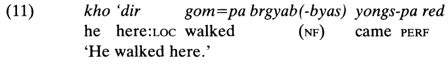
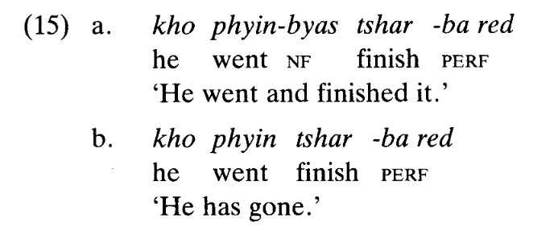
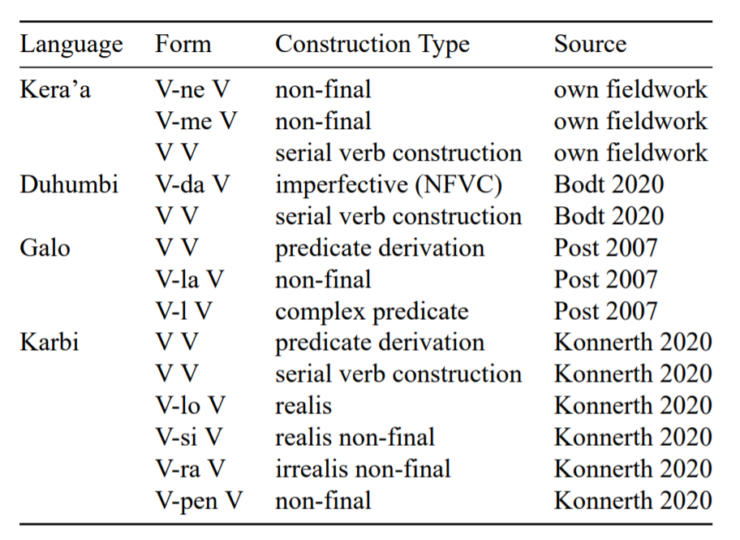
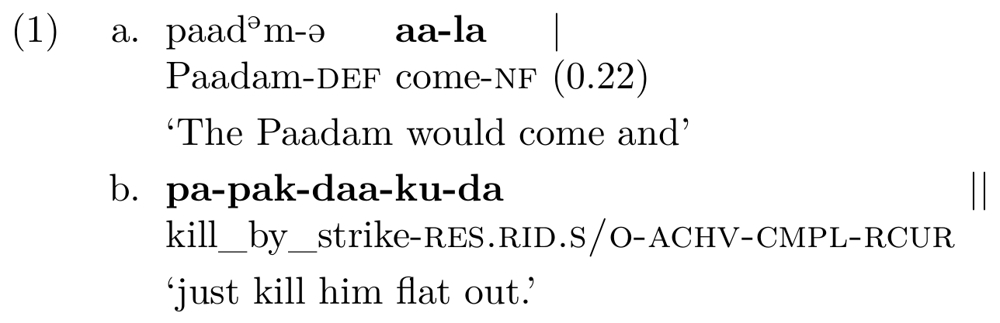
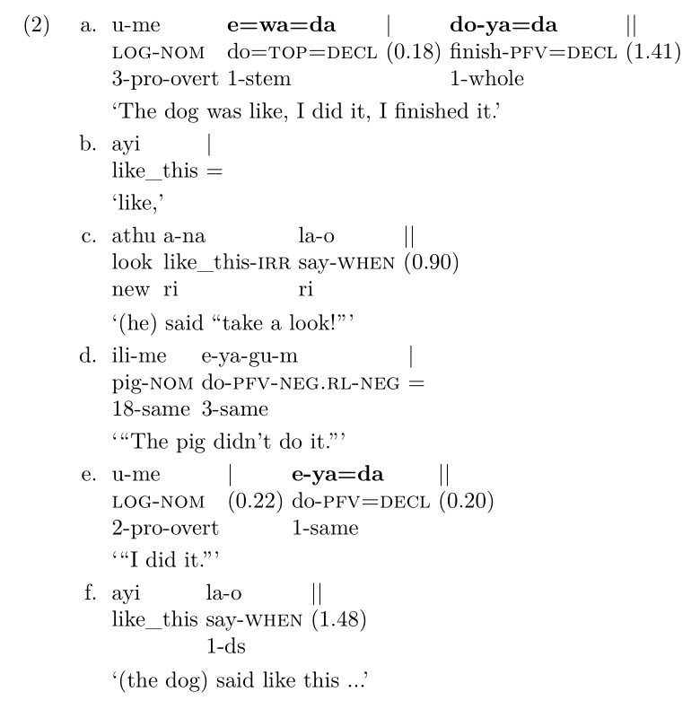
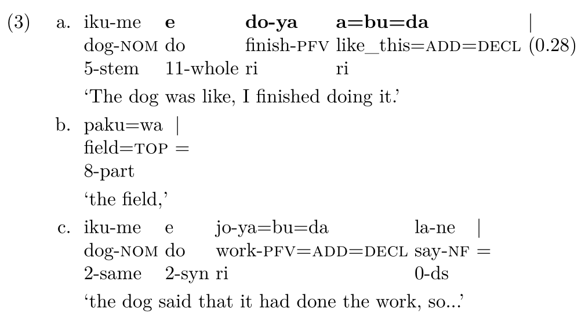
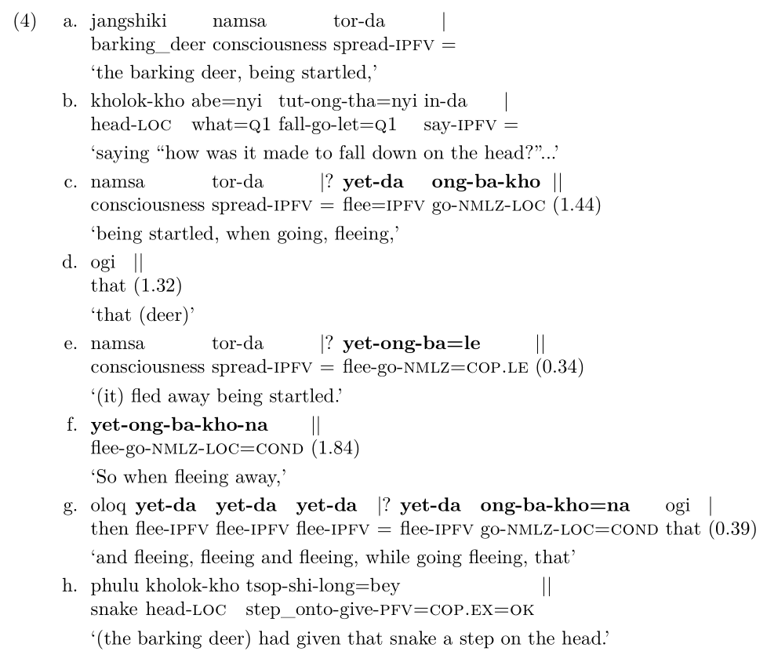
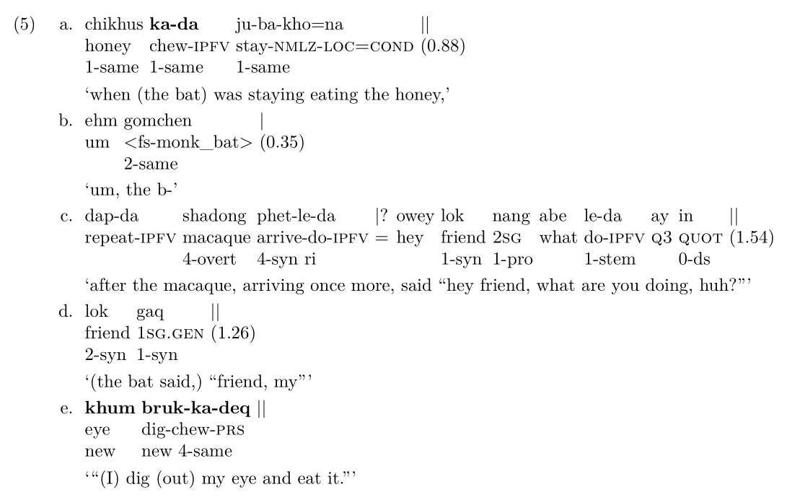
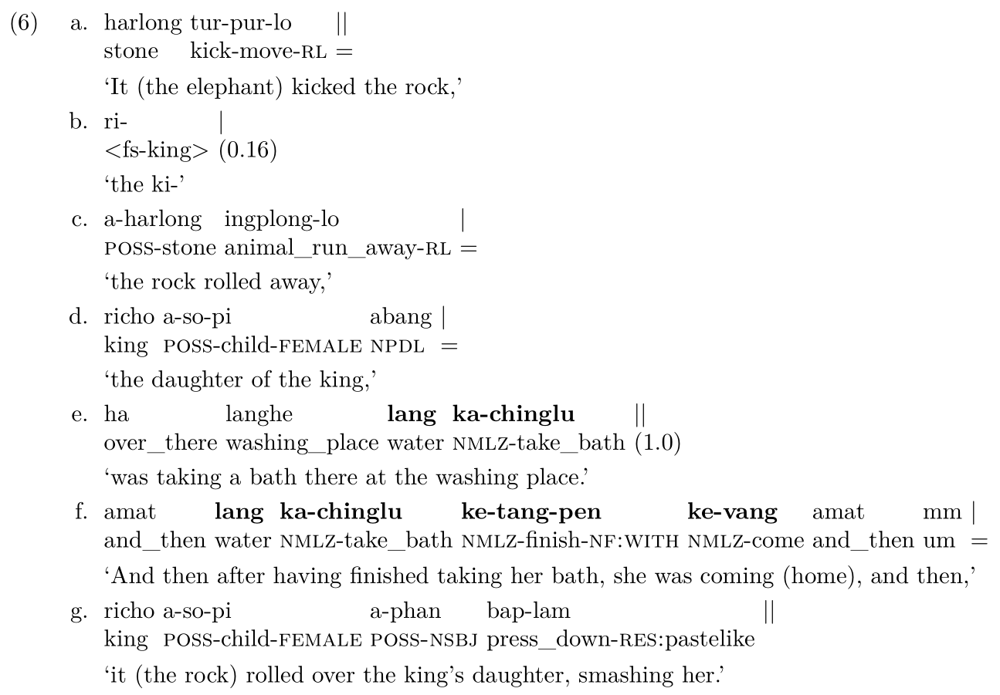
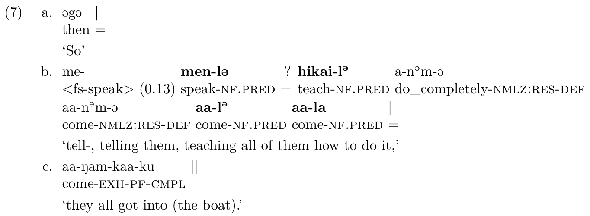

```{r include = FALSE}
html_tag_audio <- function(file,
                           type = "wav")
{
  htmltools::tags$audio(controls = NA,
                        htmltools::tags$source(src = file,
                                               type = glue::glue("audio/{type}",
                                                                 type = type)))
}
```

class: inverse, center, middle

background-image:
background-size: cover

# Multi-verbal expressions and the “one intonation unit” constraint &nbsp;

## Naomi Peck &nbsp;

### Albert-Ludwigs-Universität Freiburg <br> `r Sys.Date()`
&nbsp;


---

class: middle, center

# What does it mean if something is realised within a single intonation unit?

???

I'm presenting some early results from my PhD thesis, so this very much represents a work in progress. I look forward to hearing your feedback!

---

# Outline

1. Clause chains to SVCs?

1. Research Questions

--

1. Present Study

    - Four Northeast Indian Languages
    
    - Targeted Constructions
    
    - Intonation Unit Approach
    
--

1. Overall Results

1. Taking a closer look

    - Discourse Structure
    
    - Verbal Meaning
    
    - Weakening Prosodic Boundaries

1. Conclusion

---

# Clause chains to SVCs?


In the Himalayas, a pathway of grammaticalisation in which clause-chaining constructions become serial verb constructions has been documented in a number of languages (Matisoff 1967, DeLancey 1991, Hyslop 2013).

--

&nbsp;

&nbsp;

However, we do not know yet what triggers the grammaticalisation process. A prerequisite is hypothesised to be the occurrence of the whole clause-chaining construction within a single intonation unit.

--

&nbsp;

&nbsp;

Interestingly, serial verb constructions are commonly defined by their occurrence within a single intonation unit (Givón 1991).  

???

If we look at cases in which there is alternation between clause chaining and SVC constructions, we can get a little bit of an idea into this process.

---

# Clause chains to SVCs?

#### Lhasa Tibetan (DeLancey 1991:8-9)



--
  
&nbsp;

&nbsp;
  
### ... Thus, for example, (11) with and without /cææ/ or /næ/ could translate as 'came on foot' vs. 'walked hither' [respectively].

???

My most linguistically sophisticated (and most conservative) consultant articulates an intuition that the difference between forms with and without NF marking reflects a difference in which one of the two verbs is the "main" verb of the sentence.

---

# Clause chains to SVCs?

#### Lhasa Tibetan (DeLancey 1991:10)


.middle[

]

???

semantic restrictions

The clear difference in meaning in (14)-(15) between sequences of verbs with and without the NF particle demonstrates a fact which will underlie our subsequent argument, viz. that a construction with a sequence of two verbs separated by a subordinator is biclausal, while an unmediated sequence of verbs belongs to a single clause.

---

# Research Questions

1. Is the validity of the clause-chain to serial verb grammaticalisation pathway supported when we examine more languages?  <br><br><br><br>

--

1. Is the occurrence of the whole clause-chaining construction within a single intonation unit a prerequisite for its grammaticalisation into a SVC?  <br><br><br><br>

--

1. Must SVCs occur within a single intonation unit?  

---
class: inverse, center, middle

# The Present Study

---

# Four Northeast Indian Languages

```{r out.width='100%', fig.height=6, eval=require('leaflet'), echo=FALSE}
library(leaflet)

leaflet() %>% 
  addProviderTiles(providers$Stamen.Terrain) %>% 
  addMarkers(lng=95.90251, lat=28.795724, label="Kera'a", labelOptions = labelOptions(noHide = T)) %>%
  addMarkers(lat=27.659580, lng=94.702077, label="Galo", labelOptions = labelOptions(noHide = T)) %>%
  addMarkers(lat=27.430166, lng=92.207405, label="Duhumbi", labelOptions = labelOptions(noHide = T)) %>%
  addMarkers(lat=25.845962, lng=93.437922, label="Karbi", labelOptions = labelOptions(noHide = T))
```

???

Duhumbi, Karbi, Galo have online corpora, which should all be open-access
I have done some fieldwork in Kera'a

---

# Four Northeast Indian Languages

#### Commonalities

1. SOV main word order

1. Multi-verbal expressions

1. Clause chaining

1. Tail-head linkage

#### Differences

2. Duhumbi non-tonal; while Galo, Karbi, Kera'a are all tonal

2. Different types of MVE described for each languages

2. Data for Duhumbi, Galo, Karbi from open-access corpora; Kera'a corpus from fieldwork


---

# Targeted Constructions

.center[
```{r out.width="80%", out.height="80%", echo=FALSE}


```
]

???

I looked at a number of serial verb constructions where two verbs had no intervening morphology, as well as clause-chaining and converb constructions in which there was linking morphology.

---

# Intonation Unit Approach

I decided to focus on the boundaries between units, rather than the units themselves, as we primarily perceive breaks between intonation units rather than the internal coherence of an intonation unit itself. 

--

I annotate the strength of intonation unit boundaries using the cesura approach (Barth-Weingarten 2016). This approach enables annotation of "fuzzy" intonation unit boundaries, which is exactly what we would expect to see if processes of grammaticalisation are underway.

--


.pull-left[
```{r echo = FALSE}

cesura <- c("||", "|", "|?")
cesura_strength <- c("strong boundary", "weak boundary", "suspected boundary")

df <- data.frame(cesura, cesura_strength)

knitr::kable(df, col.names = c("Cesura Notation", "Boundary Strength"), format = "html")

```
]

.pull-right[
```{r echo = FALSE}

pause_gloss <- c("=", "(<0.60)", "(>0.60)")
pause_meaning <- c("latching", "short pause", "long pause")

pause_df <- data.frame(pause_gloss, pause_meaning)

knitr::kable(pause_df, col.names = c("Gloss Notation", "Interpretation"), format = "html")

```
]

???

Cesura notation occurs on the transcription line, while pause notation occurs on the gloss line, aligned with the cesura annotation.

Units annotated with a strong intonation unit boundary also commonly have a steep rising or falling boundary tone.

---


# Overall Results

This is still very much a work in progress.

&nbsp;
&nbsp;

--

At first glance, all serial verb constructions appear to occur within single intonation units, while converb constructions exhibit more variation. 

--

#### Galo Origins 236

`r html_tag_audio("galo-aala.wav")`

```{r out.width="70%", out.height="70%", echo=FALSE}

```

???

converbs can be in a separate intonation unit, but not so far separated
SVCs/predicate derivations within the same intonation unit

---

class: inverse, middle, center

## However, there appear to be a number of factors influencing the distribution of constructions.

---

# Discourse Structure

Verbs originally produced separately within discourse<sup>1</sup> were later linked together in a single serial verb construction.

.footnote[
1. Discourse annotations from Reinöhl et al. (in prep).
]

---

# Discourse Structure

#### Kera'a Dog Story 034-036
`r html_tag_audio("keraa-dogstory34-36.wav")`

```{r out.width="55%", out.height="55%", echo=FALSE}

```

---

# Discourse Structure


#### Kera'a Dog Story 043 
`r html_tag_audio("keraa-dogstory43.wav")`

```{r out.width="70%", out.height="70%", echo=FALSE}

```

???
In 3a, we see that what was previously uttered separately, with separate clause-level operators, is now condensed into a single SVC.

---

# Discourse Structure

A similar phenomenon occurs with converb constructions, whereby a converb construction can later be resumed through a serial verb construction, depending on the discourse needs of the speaker.

---

# Discourse Structure

#### Duhumbi Butterfly 009 
`r html_tag_audio("duhumbi-jetong.wav")`

```{r out.width="65%", out.height="65%", echo=FALSE}

```

???

starts off with converb construction
then SVC
then goes back to converb construction

this suggests that the SVC realisation can be a discourse-driven occurrence

---

# Discourse Structure

The possible meanings expressed in discourse-dependent SVCs seem limited to at most one new idea is expressed (cf. Chafe 1994).

---

# Discourse Structure

#### Duhumbi Macaque 019-020 
`r html_tag_audio("duhumbi-macaque019-20.wav")`

```{r out.width="85%", out.height="85%", echo=FALSE}

```

---

# Verbal Meaning

Both serial verb constructions and converb constructions involving a verb with a primarily grammatical function were realised within single intonation units, regardless of whether the verbs were previously introduced in discourse.

---

# Verbal Meaning

#### Karbi Ant and the Frog 026 
`r html_tag_audio("karbi-ketangpen.wav")`

```{r out.width="78%", out.height="78%", echo=FALSE}

```

???

We see in line e that we have the new event of taking a bath
in line f, this event is repeated with the addition of the verb to finish, which is marked with a non-final marker
this unit is then followed by the verb 'to come', used here lexically


---

# Weakening Prosodic Boundaries

A number of converb constructions were also distributed over two intonation units which were either "latched" or exhibited minimal pausing in between.

--

#### Galo Origins 0289 
`r html_tag_audio("galo-menla.wav")`

```{r out.width="90%", out.height="90%", echo=FALSE}

```

???

difference in vowel quality
within an IU, the vowel is reduced almost completely to the point of elision
prior to a suspected boundary, we have a schwa annotated
prior to a slightly stronger boundary, the vowel is not as weakened

---

# Conclusion

As it stands, the "one intonation unit" generalisation for serial verb constructions does hold for these languages.<br><br><br>


--

However, the grammaticalisation pathway of clause chain to serial verb construction requires more nuance in its formulation in order to take into account discourse functions, as serial verb constructions should not be treated independently of other related multi-verbal expressions.<br><br><br>

--

Without looking at how these constructions are realised in discourse, we lose sight of why speakers may opt for certain types of multi-verb expressions. This information is crucial for understanding the phenomenon of serial verb constructions.

---

# References

Barth-Weingarten, Dagmar. 2016. *Intonation Units Revisited: Cesuras in talk-in-interaction*. Amsterdam: John Benjamins.

Bodt, Timotheus A. 2020. *Grammar of Duhumbi (Chugpa)*. Leiden: Brill.

Chafe, Wallace. 1994. *Discourse, consciousness, and time: the flow and displacement of conscious experience in speaking and writing*. Chicago: University of Chicago Press.

DeLancey, Scott. 1991. The origins of verb serialization in Modern Tibetan. *Studies in Language* 15(1), 1–23.

Givón, Talmy. 1991. Some substantive issues concerning verb serialization: Grammatical vs. cognitive packaging. In Claire Lefebvre (ed.), *Serial verb constructions: Grammatical, comparative and cognitive approaches*, 137–184. Amsterdam: John Benjamins.

---

# References

Hyslop, Gwendolyn. 2013. The Kurtöp *-si* construction: Converbs, clause-chains and verb serialization. In Timothy J. Thornes, Erik E. Andvik, Gwendolyn Hyslop, and Joana Jansen (eds.), *Functional-historical approaches to explanation: in honor of Scott DeLancey*, 155-178. Amsterdam: John Benjamins Publishing Company.

Konnerth, Linda. 2020. *A grammar of Karbi*. Berlin: Mouton de Gruyter.

Matisoff, James. 1969. Verb concatenation in Lahu: The syntax and semantics of 'simple' juxtaposition. *Acta Linguistica Hafniensa* 12(2), 69-120.

Post, Mark W. 2007. A grammar of Galo. PhD Dissertation. Bundoora: La Trobe University.

Reinöhl, Uta, Kirsten Culhane, Simon Fries, Naomi Peck and Maria Vollmer. In preparation. Serial verbs and 'flat' nominal expressions: Pushing the boundaries of information packaging?

---

class: inverse, center, middle

# Thank you!

&nbsp;&nbsp;&nbsp;

#### This research was supported by funding from Deutsche Forschungsgemeinschaft (DFG) Project number 406074683, Emmy Noether-Gruppe "Non-hierarchicality in grammar: Construction formation without word class distinction across categories and languages".