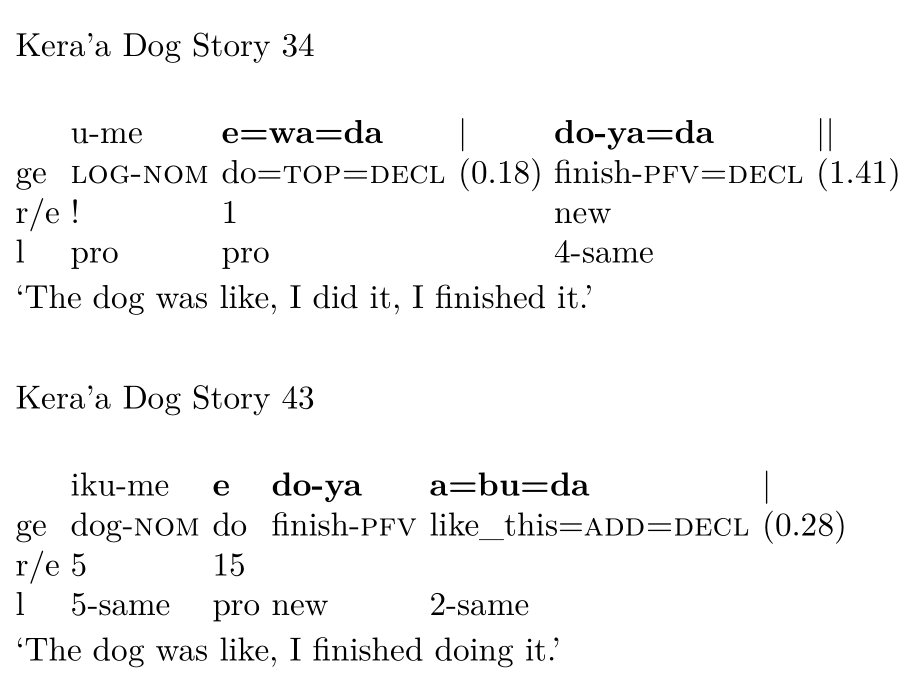

class: inverse, center, middle

```{r setup, include=FALSE}
options(htmltools.dir.version = FALSE)
#devtools::install_github("gadenbuie/countdown")
library(countdown)
library(DiagrammeR)
html_tag_audio <- function(file,
                           type = "wav")
{
  htmltools::tags$audio(controls = NA,
                        htmltools::tags$source(src = file,
                                               type = glue::glue("audio/{type}",
                                                                 type = type)))
}
```

# (Re-)Contextualising Serial Verb Constructions <br>
## Annotations for Morphosyntax, Prosody, and Discourse <br> <br>

## Naomi Peck &nbsp;

.pull-left[

]

.pull-right[
### NonGram Workshop <br> Freiburg <br> 2022-04-11
]

---

class: center, middle

# What is an SVC?

---

> *Briefly, I define a serial verb construction as a monoclausal construction consisting of multiple independent verbs with no element linking them and with no predicate-argument relation between the verb.*
>
> Haspelmath 2016:292

--

<br>

> *Serial verbs thus reveal themselves, with great cross-language consistency, to be rather non-prototypical verbs. ... It is thus not lexical verbhood per se, but rather "grammatical verbhood", that turns out to reflect cognition.*
>
> Givòn 1991:176

--

<br>

> *A serial verb construction (SVC) is a sequence of verbs which act together as a single predicate, without any overt marker of coordination, subordination, or syntactic dependency of any other sort. Serial verb constructions describe what is conceptualized as a single event.*
>
> Aikhenvald 2006:1

---

class: middle

> *As has been shown, SVCs can be defined according to certain grammatical categories that are structurally manifested or in terms of the one overarching cognitive property of single eventhood. ... one will have to conclude that **it is still an open question to what extent what is discussed under the label of 'serial verb construction' in a large number of analyses of individual languages or groups of languages is actually a cross-linguistically coherent phenomenon**.*
>
> Bisang 2009:811-812

---

class: inverse, center, middle


# What happens when we look at SVCs <br> *in context*?

---

## Outline

- How can we (re)contextualise SVCs?

- Morphosyntactic Annotations

- Prosodic Annotations

- Discourse Annotations

- Open Questions

---

class: inverse, middle

# How can we (re)contextualise SVCs?

---

## Changing the research paradigm

Most grammatical approaches to SVC research look at these constructions out of context, often simply as sentences within a corpora, and treat them as a purely grammatical phenomenon. This approach is often taken in comparative studies (e.g. Haspelmath 2016).

--

<br>
However, various researchers have noted that SVCs are intertwined with discourse structure (e.g. Pawley 2009), and we have barely begun to understand the prosody of serial verb constructions cross-linguistically (cf. Givón 1991).

> *...I [previously] omitted reference to some other types of serial verb constructions because that I felt that these phenomena should be considered as more appropriately part of discourse structure than syntax, and therefore somehow worthy of exclusion from my grammar.* 
>
> Crowley 2002:9

---

## Changing the research paradigm

Researchers who take a primarily cognitive approach, i.e. focus on the equation 1 SVC = 1 event, often rely on long-held assumptions about the nature of events which were based largely on Indo-European languages.

--

<br>

We are now at the stage where these assumptions can turn into empirical questions. 

*Do* SVCs only represent a single event? 

Can SVCs represent *more than one* event?

--

<br>

Looking at SVCs within the context of discourse is a starting point to investigate their cognitive status for interlocutors. We can utilise Chafe's (1994) "one new idea" hypothesis to start to probe this issue.

---

## Changing the research paradigm

Works on grammaticalisation hypothesise various sources for serial verb constructions, such as:

- clause chaining (DeLancey 1991)
- converb constructions (Bisang 1995)
- switch reference clause chaining (Pawley 2009)
- verb coordination/hendiadys (Hopper 2008, Barth-Weingarten & Couper-Kuhlen 2011)

--

<br>

What happens if we account for these constructions in a study of SVCs?

---

## Compounding Returns

.center[
```{r out.width="90%", out.height="90%", echo=FALSE}

```
]

---

## Case Study

```{r out.width='100%', fig.height=6, eval=require('leaflet'), echo=FALSE}
library(leaflet)

leaflet() %>% 
  addProviderTiles(providers$Stamen.Terrain) %>% 
  addCircleMarkers(lng=95.90251, lat=28.795724, label="Kera'a", labelOptions = labelOptions(noHide = T)) %>%
  addCircleMarkers(lat=27.659580, lng=94.702077, label="Galo", labelOptions = labelOptions(noHide = T)) %>%
  addCircleMarkers(lat=27.430166, lng=92.207405, label="Duhumbi", labelOptions = labelOptions(noHide = T)) %>%
  addCircleMarkers(lat=25.845962, lng=93.437922, label="Karbi", labelOptions = labelOptions(noHide = T))
```

---

class: inverse, middle

# Morphosyntactic Annotations

---

## Unit-focused

I aim to focus on constructions that are treated externally as a monoclausal unit in some manner by the morphosyntax, rather than the traditional focus of SVC studies on the internal make-up of a unit. Within this larger monoclausal multiverbal construction set, I take SVCs to be a multiverbal construction without an overt marker of a hierarchical relationship between verbs.

--

<br> <br>

To investigate the unithood of multiverbal constructions and their distribution, I code each instance of a multiverbal construction according to a list of definitional and informational parameters.

---

## Coding Parameters

```{r echo = FALSE}

parameters <- c("contiguous", "one tense value", "one aspect value", "one mood value", "one evidentiality value", "one polarity value", "one illocutionary force value", "different agent arguments", "different patientive arguments")
trackers <- c("both independent verbs elsewhere", "overt linkage", "predicative function of unit", "", "", "", "", "", "")

df <- data.frame(parameters, trackers)

knitr::kable(df, col.names = c("Definitional Parameters", "Informational Parameters"), format = "html")

```

???

Parameters are designed to be independent

---

## Annotation and Coding Workflow

1. Data is imported into ELAN and annotated with GRAID (Haig and Schnell 2014).

2. All tokens of constructions meeting the multiverbal construction definition are coded in a separate spreadsheet according to the definitional and informational parameters. Each parameter receives one of the following values:

```{r echo = FALSE}
values <- c("0", "1", "2", "?")
meanings <- c("absence", "presence", "ambiguous", "unsure")

df <- data.frame(values, meanings)

knitr::kable(df, col.names = c("Value", "Meaning"), format = "html")
```

This spreadsheet is then imported into R for further analysis.

---

## Analysis

<br> <br>

```{r echo = FALSE, fig.width=10, fig.height=5, fig.align='center'}

grViz(diagram = "digraph flowchart {
  node [fontname = helvetica, shape = box]
  tab1 [label = '@@1']
  tab2 [label = '@@2']
  tab3 [label = '@@3']
  tab4 [label = '@@4']
  tab5 [label = '@@5']
  tab6 [label = '@@6']
  
  tab1 -> tab2;
  tab1 -> tab3;
  tab2 -> tab4;
  tab3 -> tab5;
  tab3 -> tab6
}
  
  [1]: 'Exploratory Data Analysis'
  [2]: 'Clustering Techniques'    
  [3]: 'Ordination Techniques'
  [4]: 'Multivariate Cluster Analysis'
  [5]: 'Principal Component Analysis'
  [6]: 'Multidimensional Scaling'
  ")

```
???

Clustering Techniques: Multivariate cluster analysis
Do we see any grouping of constructions based on these parameters? (with/out trackers)
What groups fall out of an analysis?

Ordination Techniques:

Multidimensional Scaling: visualising where the points fall when we compress the data into N-dimensions
Principal Component Analysis: when data is compressed into a N-dimensional space, what factors represent each dimension? What factors are most important in determining a multiverbal construction?

Testing these using R^2 test

---

class: inverse, middle

# Prosodic Annotations

---

## What's an IU?

An intonation unit is a stretch of speech which we use to structure our discourse.

Prototypical intonation units are characterised by:

1. a coherent intonation contour
1. pitch reset at the beginning
1. pauses on either side
1. an initial rush (anacrusis)
1. a final lengthening of syllables

--

<br>

However, we don't recognise intonation units by perceiving their unithood - rather, we recognise intonation units using the boundaries *between* units.

---

## What's an IU *boundary*?

Intonation unit boundaries represent a disfluency in melody and a potential disfluency in rhythm during speech. Like many phenomena in Language, intonation unit boundaries are a gradient phenomenon, with the only universal cue for an IU boundary being a pitch reset (Himmelmann et al. 2018). 

Possible additional boundary cues include pauses, anacrusis, final lengthening, boundary tones, changes in voice quality and inhalation and exhalation. When multiple boundary cues occur at a similar point in time, the perception of a stronger intonation unit boundary is created.

--

<br>

To deal with the gradient nature of boundary strength, I use the idea of *caesurae* (Barth-Weingarten 2016). Caesurae refer to the cumulative effect of changes in phonetic-prosodic parameters which result in the perception of disfluencies in the flow of talk (p. 60). They do not presuppose any unit-based analysis and allow for a desirable level of granularity.

---

## Annotations and Coding Workflow

1. Data in ELAN is annotated using intonation units as much as possible, i.e. stretches of speech between two clear caesurae.

1. Additional caesurae and boundaries are indicated in the transcription line. Extra annotations are populated with the length of pauses.

.pull-left[
```{r echo = FALSE}

cesura <- c("||", "|", "|?")
cesura_strength <- c("strong caesura", "weak caesura", "suspected caesura")

df <- data.frame(cesura, cesura_strength)

knitr::kable(df, col.names = c("Caesura Notation", "Caesura Strength"), format = "html")

```
]

.pull-right[
```{r echo = FALSE}

boundary_tone <- c("/", "//", "." , ",", ";")
boundary_meaning <- c("non-terminal", "terminal", "clear fall", "clear rise", "no clear rise or fall")

boundary_df <- data.frame(boundary_tone, boundary_meaning)

knitr::kable(boundary_df, col.names = c("Boundary Tone Notation", "Meaning"), format = "html")

```
]


???

Cesura notation occurs on the transcription line, while pause notation occurs on the gloss line, aligned with the cesura annotation.

Units annotated with a strong intonation unit boundary also commonly have a steep rising or falling boundary tone.

---

exclude: true

## Annotations and Coding Workflow

1. ELAN data are exported as TextGrids, which go through a further processing step to prepare them for automatic speech recognition processes.

1. An automatic speech recognition process is run with TextGrids and accompanying audio files for automatic phone and syllable annotations.

1. These annotations are fed into SLAM+ (Liu et al. 2019) for automatic pitch (contour) annotation at a local and global level.

---

## Annotations and Coding Workflow

1. Using the existing spreadsheet for morphosyntactic annotations, each token will be annotated for alignment with caesurae on the right and left edges of the construction, following Park 2002.

1. I additionally annotate whether a caesura occurs anywhere between the two verbs.

```{r echo = FALSE}
values <- c("0", "1", "2", "?")
meanings <- c("absent", "present", "ambiguous", "unsure")

df <- data.frame(values, meanings)

knitr::kable(df, col.names = c("Value", "Meaning"), format = "html")
```

---

## Qualitative Analysis

My first prosodic analysis will investigate the correlations between construction choice, caesura strength, and boundary tone type. 

In the event that a multiverb construction involves a caesura or a suspected caesura between verbs, I will examine what boundary cues are present, including boundary tone type. This will be done through largely perceptual means with the help of acoustic visualisation and measurement tools like Praat. 

--

<br>

The analysis should provide us with information as to what tendencies exist in regards to prosodic phrasing of multiverbal constructions, and whether certain boundary tones and other cues occur more commonly with certain kinds of construals.

---

## Quantitative Analysis

Using the parametric data, I will investigate potential correlations between prosodic phrasing and morphosyntactic realisation. This analysis will generate insights into preferred prosodic phrasing strategies for a given construction, as well as lead to one of the first cross-linguistic studies of how SVCs are intonationally realised. 

--

<br>

This analysis will help to test hypotheses laid out in Himmelmann 2022 regarding prosodically-dependent grammatical constructions, as well as provide rich prosodic evidence for researchers interested in the grammaticalisation pathways of multiverbal constructions.

---

class: inverse, middle

# Discourse Annotations

---

## Events in Discourse

Using the Emmy-Noether-Gruppe annotation scheme on a wider scale, we can easily track the (potential) activation of Chafian ideas in discourse. This involves coding simplex verbal expressions as well as nominals within my data set.

--


```{r out.width="65%", out.height="65%", echo=FALSE}

```

???
In 2, we see that what was previously produced separately with separate clause-level operators in 1, is now condensed into a single SVC.

---

## Annotation and Coding Workflow

1.    Data annotated in ELAN which have GRAID annotations (Haig and Schnell 2014) will receive Emmy-Noether-Gruppe Annotations (Reinöhl et al. in prep).

<br>

The ELAN annotations will be imported into R for further analysis.

---

## Qualitative Analysis

The results from the previous analyses of the morphosyntax and prosody of multiverbal constructions will feed into the discourse analysis process. Matching up the distributions from each of these three levels will provide extraordinarily rich data to investigate the "what's where why" of SVCs.

These analyses will help to assess whether serial verb constructions can express no more than "one new idea", and therefore, no more than one event. 

In cases where serial verb constructions express multiple ideas, we can ground this in a discourse context, especially when it relates to differences in constructional choices made by speakers. 


---

## Quantitative Analysis

The combination of annotations also lends itself well to a quantitative approach. As we track both "intonation unithood" as well as information flow, we can simulate idea activation using *Information Theory* approaches.

Information Theory (Shannon 1948) concerns itself with the maximal amount of information that can be transmitted given a certain level of background noise. This has been extended into multiple domains, including theories of language processing and working memory.

--

<br>

We can theoretically use this theoretical approach to measure the flow of 'heavy' information across a given text. We can then model when we expect a new idea to occur or a given construction to be used, given the decay of information in our working memory and its affect on the surprisal level for a piece of information.

---

class: center, middle

```{r out.width="90%", out.height="90%", echo=FALSE}

```

---

## References

<font size="-1">Aikhenvald, Alexandra Y. 2006. Serial verb constructions in typological perspective. In Alexandra Y. Aikhenvald & R.M.W. Dixon (eds.), <it>Serial Verb Constructions: A Cross-linguistic Typology</it>, 1–68. Oxford: Oxford University Press.<br>
Barth-Weingarten, Dagmar. 2016. <it>Intonation Units Revisited: Cesuras in talk-in-interaction</it>. Amsterdam: John Benjamins Publishing Company.<br>
Barth-Weingarten, Dagmar & Elizabeth Couper-Kuhlen. 2011. Action, prosody and emergent constructions: The case of and. In Peter Auer & Stefan Pfänder (eds.), <it>Constructions: Emerging and Emergent</it>, 263-292. Berlin, Boston: De Gruyter.<br>
Bisang, Walter. 1995. Verb serialization and converbs: differences and similarities. In Martin Haspelmath & Ekkehard König (eds.), <it>Converbs in Cross-Linguistic Perspective</it>, 137–188. Berlin: De Gruyter.<br>
Bisang, Walter. 2009. Serial Verb Constructions. <it>Language and Linguistics Compass</it> 3(3). 792–814. https://doi.org/10/bpcwnr.<br>
Chafe, W. 1994. <it>Discourse, Consciousness and Time: The Flow and Displacement of Conscious Experience in Speaking and Writing</it>. Chicago: University of Chicago Press.<br>
Crowley, Terry. 2002. <it>Serial Verbs in Oceanic</it>. Oxford: Oxford University Press.<br>
DeLancey, Scott. 1991. The Origins of Verb Serialization in Modern Tibetan. <it>Studies in Language</it> 15(1). 1–23. https://doi.org/10/c4t23s. <br>
ELAN (Version 6.3) [Computer software]. (2022). Nijmegen: Max Planck Institute for Psycholinguistics, The Language Archive. Retrieved from https://archive.mpi.nl/tla/elan <br>
Givón, Talmy. 1991. Serial verbs and event cognition in Kalam:An empirical study of cultural relativity. In Claire Lefebvre (ed.), <it>Serial Verbs: Grammatical, Comparative and Universal grammar</it>, 137–184. Amsterdam: John Benjamins.</font>

---

## References

<font size ="-1">Haig, Geoffrey & Stefan Schnell. 2014. Annotations using GRAID (Grammatical Relations and Animacy in Discourse): Introduction and guidelines for annotators, Version 7.0. (multicast.aspra.uni-bamberg.de/)<br>
Haspelmath, Martin. 2016. The Serial Verb Construction: Comparative Concept and Cross-linguistic Generalizations. <it>Language and Linguistics</it> 17(3). 291–319. https://doi.org/10/gdm725.<br>
Himmelmann, Nikolaus P. 2022. Prosodic phrasing and the emergence of phrase structure. <it>Linguistics</it> 0(0). https://doi.org/10.1515/ling-2020-0135.<br>
Himmelmann, Nikolaus P., Meytal Sandler, Jan Strunk & Volker Unterladstetter. 2018. On the universality of intonational phrases: a cross-linguistic interrater study. <it>Phonology</it> 35(2). 207–245. https://doi.org/10/ghmnqf.<br>
Hopper, Paul. 2008. Emergent serialization in English: Pragmatics and typology. In Jeff Good (ed.), <it>Linguistic Universals and Language Change</it>, 253-284. Oxford: Oxford University Press.<br>
Park, Joseph Sung-Yul. 2002. Cognitive and interactional motivations for the intonation unit. <it>Studies in Language</it> 26(3). 637–680. https://doi.org/10/cg39nh.<br>
Pawley, Andrew. 2009. On the origins of serial verb constructions in Kalam. In Talmy Givón & Masayoshi Shibatani (eds.), <it>Typological Studies in Language</it>, 119–144. Amsterdam: John Benjamins. https://doi.org/10.1075/tsl.85.05ont.<br>
Reinöhl, Uta, Kirsten Culhane, Simon Fries, Naomi Peck & Maria Vollmer. In preparation. Serial verbs and 'flat' nominal expressions: Pushing the boundaries of information packaging?<br>
Shannon, Claude E., 1948. A Mathematical Theory of Communication. <it>Bell System Technical Journal</it>, 27. 379-423 & 623-656.</font>

---

class: inverse, middle

# Open Questions

---

# Open Questions

- Are there any relevant parameters of morphosyntactic unithood that I have not included? Are there any dependencies in the parameters you can see?

- Do I need to conduct a quantitative analysis of boundary tones involving acoustic measurements?

- What kind of statistical techniques make sense for the investigation of the prosody-syntax mapping?

- How can I operationalise an informational theory approach? What can be done given the relative lack of resources (data)?

---

class: inverse, middle, center

# Thank you!